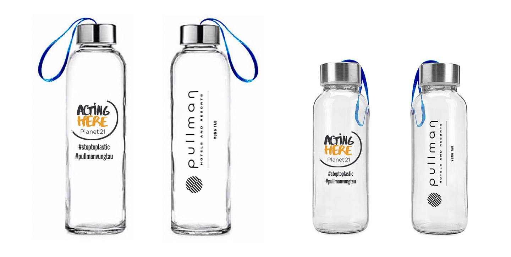

# Bai viet: 8 tuyet ky ban hang

- **URL goc:** https://keystone.vn/8-tuyet-ky-ban-hang
- **Slug:** `baiviet-8-tuyet-ky-ban-hang`
- **So hinh anh:** 5
- **So link noi bo:** 34

---

## NOI DUNG TEXT

# Tuyệt kỹ bán hàng

> Meta description: Đây là bài viết nói về 8 tuyệt chiêu bán một chiếc ly với giá cao

- Mon - Sun: 8.30am to 6.30 pm
- 0903997909
- [email protected]
- Đăng nhập / Đăng ký

- KEYSTONE!?
- DỊCH VỤ Đào tạo Huấn luyện Teambuilding Thiết kế doanh nghiệp HR Tech
- ĐÀO TẠO Ứng Dụng AI Tools @ Workplace Train The Trainer Lãnh đạo Bán hàng Quản lý Tư duy và công cụ Kỹ năng mềm Giao tiếp
- Events
- TIN TỨC Blog Cộng đồng Chia sẻ Tuyển Dụng
- LIÊN HỆ

## 8 tuyệt kỹ bán hàng

- Trang chủ
- Training

Tuyệt kỹ sales

Một chiếc ly 8 phương án bán hàng khác nhau, giá trị có thể tăng lên cả ngàn lần

Một ly đựng rượu, bạn có thể coi nó chỉ là một công cụ đong đựng bình thường, bán giá 3 đồng/chiếc, tất nhiên đa số mọi người sẽ chả thèm để ý đến nó.

Thế nhưng, nếu như bạn biến nó thành một biểu tượng cho cảm xúc, văn hóa, kỳ vọng, thể diện, tôn nghiêm và địa vị…, bán nó 3000 đồng hoàn toàn có khả năng cung sẽ không đủ cầu, và muốn vậy đòi hỏi bạn phải có IQ và EQ cao. Chiếc ly vẫn sẽ là chiếc ly, quan trọng là bạn bán nó theo cách nào.

Một công ty chuyên kinh doanh rượu vang trong quá trình lập kế hoạch cho bao bì sản phẩm vấp phải những tranh cãi kịch liệt về định giá sản phẩm, nguyên nhân là do một số lãnh đạo doanh nghiệp cho rằng định giá quá cao so với giá thành sản xuất thì sản phẩm không thể nào bán được.

Cuối cùng để thuyết phục được ban lãnh đạo công ty, một nhân viên chiến lược đã lấy ví dụ về “một chiếc ly có thể bán được bao nhiêu tiền” để thuyết phục được họ.

Phương pháp bán thứ nhất: Bán giá trị sử dụng của sản phẩm, chỉ có thể bán 3 đồng/chiếc

Nếu bạn chỉ coi đó là một cái ly bình thường, bán trong những cửa hàng bình dân và dùng những phương thức bán hàng thông thường, nó chỉ có thể bán giá cao nhất là 3 đồng/chiếc. Thậm chí, còn có thể bị chủ cửa hàng tạp hóa bên cạnh dùng chiêu giảm giá để ép giá sản phẩm. Đây là kết cục bi thảm của việc không có giá trị sáng tạo.

Phương pháp bán thứ 2: Bán giá trị văn hóa của sản phẩm, có thể bán 5 đồng/chiếc

Nếu ta thiết kế nó có hình dáng được ưa chuộng nhất hiện nay, có thể bán nó với giá 5 đồng/chiếc. Như vậy, chiêu giảm giá để ép giá sản phẩm của cửa hàng bên cạnh sẽ không có hiệu lực nữa. Bởi chiếc ly của chúng ta có xu thế thời đại, người tiêu dùng sẵn sàng trả nhiều tiền hơn để mua chúng, đây chính là sự đổi mới giá trị văn hóa của sản phẩm.

Phương pháp bán thứ 3: Bán giá trị thương hiệu của sản phẩm, có thể bán 7 đồng/chiếc

Nếu bạn gắn cho nó một cái nhãn là của một thương hiệu nổi tiếng, bạn có thể bán nó 6 hoặc 7 đồng/chiếc. Lúc đó, cửa hàng bên cạnh có bán 3 đồng/chiếc cũng chả ăn thua, bởi cái ly của bạn là hàng có thương hiệu, hầu như mọi người đều sẵn sàng để chi tiền để mua đồ có thương hiệu. Đây chính là sự đổi mới giá trị thương hiệu của sản phẩm.

Phương pháp bán thứ 4: Bán giá trị tổ hợp của sản phẩm, bán được 15 đồng/chiếc

Nếu như bạn sản xuất ba chiếc ly có hình nhân vật dễ thương thành một bộ dùng cho gia đình, chúng được đóng gói đẹp mắt và tinh tế, bạn đặt tên cho bộ sản phẩm là “Tôi yêu gia đình tôi”, một ly tên là “Tình yêu của cha”, một ly tên là “Tình yêu của mẹ”, một ly tên là “Tình yêu của con”, bạn bán cả bộ này giá 50 đồng không thành vấn đề.

Khi đó, cửa hàng cạnh bạn có bán 3 đồng/chiếc, treo biển to cỡ nào cũng vô dụng, các em nhỏ sẽ kéo tay bố mẹ đi mua bộ gia đình hạnh phúc “Tôi yêu gia đình tôi”. Đây là sự đổi mới giá trị cho tổ hợp sản phẩm.

Phương pháp bán thứ 5: Bán giá trị chức năng của sản phẩm, có thể được bán 80 đồng/chiếc

Nếu như bạn đột nhiên phát hiện ra vật liệu để sản xuất chiếc ly này là vật liệu từ tính, thì tôi có thể giúp bạn liệt kê ra được những công dụng của liệu pháp từ trong việc chăm sóc sức khỏe, bán 80 đồng/chiếc là hoàn toàn có thể. Như vậy, cửa hàng bên cạnh bạn không dám để 3 đồng/chiếc nữa, vì chả ai tin một chiếc ly giá 3 đồng/chiếc có liệu pháp từ chăm sóc sức khỏe. Đây chính là sự đổi mới giá trị chức năng của sản phẩm.

Phương pháp thứ 6: Bán giá trị thị trường của sản phẩm, 188 đồng/1 đôi không thành vấn đề

Nếu bạn in thêm 12 cung hoàng đạo trên chiếc ly có liệu pháp từ của bạn, đồng thời đóng gói nó thành cặp trong một chiếc hộp tình nhân rồi đặt tên bộ sản phẩm đó là “Trời sinh một cặp” hay “Thiên trường địa cửu”, chủ yếu nhằm vào sinh nhật của các cặp tình nhân, bán 188 đồng/cặp sẽ giải quyết được vấn đề đau đầu của những cặp tình nhân không biết mua quà gì cho bên kia vào mỗi dịp sinh nhật. Đây chính là đổi mới giá trị thị trường sản phẩm.

Phương pháp thứ 7: Bán giá trị bao bì sản phẩm, bán 288 đồng/1 đôi có khi bán càng được nhiều

Nếu như đem bộ sản phẩm có liệu pháp từ và in cung hoàng đạo bọc trong ba loại bao bì khác nhau: một loại bao bì vừa phải bán 188 đồng/đôi; một loại bao bì tinh tế và đẹp mắt bán 238 đồng/đôi; một loại bao bì phong cách và sang trọng bán 288 đồng/đôi.

Như vậy có thể khẳng định được rằng, bán được nhiều nhất chắc chắn là loại 238 đồng/đôi. Đây chính là sự sáng tạo giá trị bao bì sản phẩm

Phương pháp thứ 8: Bán giá trị kỉ niệm của sản phẩm, lúc nào cũng có thể bán được 3000 đồng/chiếc

Nếu như chiếc ly này được những người nổi tiếng như Obama, Messi… dùng để uống nước thì bán 3000 đồng/chiếc lúc nào cũng có người mua. Đây chính là sáng tạo giá trị kỉ niệm sản phẩm.

Như vậy, cùng là một chiếc ly, thế giới bên trong của chúng: bao gồm chức năng, kết cấu, tác dụng… mặc dù vẫn được giữ nguyên nhưng tùy thuộc vào sự thay đổi của thế giới bên ngoài mà giá trị của những chiếc ly này sẽ không ngừng thay đổi theo.

Hay cùng một chiếc ly, nhưng với các chiến lược đổi mới giá trị khác nhau sẽ cho kết quả kinh doanh khác nhau, bởi người tiêu dùng khi mua bất kì sản phẩm nào, ngoài giá trị sử dụng chính của sản phẩm, cái mà họ cần mua hơn cả là tính biểu tượng của cảm giác, văn hóa, địa vị, thể diện, sự tôn nghiêm và tôn trọng…

Còn rất nhiều phương pháp bán khác…

Hãy sáng tạo phương pháp bán hàng theo cách của bạn.

Trích từ CẨM NANG CEO

#### Danh mục

- HR
- Learning & Development

#### Bài viết liên quan

KEYSTONE | Developing People.

Giải pháp đào tạo chuyên nghiệp!

CÔNG TY CỔ PHẦN CÔNG NGHỆ VÀ ĐÀO TẠO KEYSTONE

Người đại diện: NGUYỄN VĂN THỨC

- Tòa nhà Barotex, Số 6 Võ Văn Kiệt, Phường Sài Gòn, Thành phố Hồ Chí Minh, Việt Nam

### DỊCH VỤ

- Đào tạo
- Huấn luyện
- Teambuilding
- Thiết kế doanh nghiệp
- HR Tech

### ĐÀO TẠO

- Ứng Dụng AI
- Tools @ Workplace
- Train The Trainer
- Lãnh đạo
- Bán hàng
- Quản lý
- Tư duy và công cụ
- Kỹ năng mềm
- Giao tiếp

### HỖ TRỢ

- Chính sách và quyền riêng tư
- Điều khoản sử dụng
- Những câu hỏi thường gặp
- Hoàn trả và hủy vé
- Phương thức giao hàng
- Hướng dẫn mua vé

### Đăng ký email

---

## HINH ANH TREN TRANG

- 
- 
- 
- 
- 

---

## LINK NOI BO TREN TRANG

- [[email protected]](https://keystone.vn)
- [Đăng nhập / Đăng ký](https://keystone.vn/dang-nhap)
- [(no text)](https://keystone.vn/)
- [KEYSTONE!?](https://keystone.vn/keystone)
- [Đào tạo](https://keystone.vn/dao-tao)
- [Huấn luyện](https://keystone.vn/huan-luyen)
- [Teambuilding](https://keystone.vn/teambuilding)
- [Thiết kế doanh nghiệp](https://keystone.vn/thiet-ke-doanh-nghiep)
- [HR Tech](https://keystone.vn/hr-technology-solutions)
- [Ứng Dụng AI](https://keystone.vn/ung-dung-ai)
- [Tools @ Workplace](https://keystone.vn/tools-@-workplace)
- [Train The Trainer](https://keystone.vn/train-the-trainer)
- [Lãnh đạo](https://keystone.vn/lanh-dao)
- [Bán hàng](https://keystone.vn/ban-hang)
- [Quản lý](https://keystone.vn/quan-ly)
- [Tư duy và công cụ](https://keystone.vn/tu-duy-va-cong-cu)
- [Kỹ năng mềm](https://keystone.vn/ky-nang-mem)
- [Giao tiếp](https://keystone.vn/giao-tiep)
- [Events](https://keystone.vn/public-event)
- [Blog](https://keystone.vn/blog)
- [Cộng đồng](https://keystone.vn/cong-dong)
- [Chia sẻ](https://keystone.vn/chia-se)
- [Tuyển Dụng](https://keystone.vn/tuyen-dung)
- [LIÊN HỆ](https://keystone.vn/lien-he)
- [Training](https://keystone.vn/training)
- [HR](https://keystone.vn/hr)
- [Learning & Development](https://keystone.vn/learning-development)
- [[email protected]](https://keystone.vn/cdn-cgi/l/email-protection)
- [Chính sách và quyền riêng tư](https://keystone.vn/chinh-sach-va-quyen-rieng-tu)
- [Điều khoản sử dụng](https://keystone.vn/dieu-khoan-su-dung)
- [Những câu hỏi thường gặp](https://keystone.vn/nhung-cau-hoi-thuong-gap)
- [Hoàn trả và hủy vé](https://keystone.vn/hoan-tra-va-huy-ve)
- [Phương thức giao hàng](https://keystone.vn/phuong-thuc-giao-hang)
- [Hướng dẫn mua vé](https://keystone.vn/huong-dan-mua-ve)
