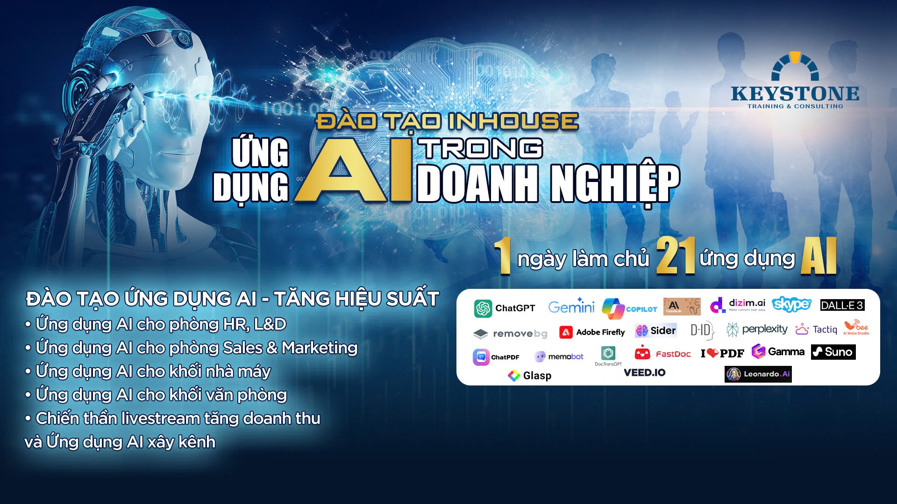

# Bai viet: AI Inhouse Doanh nghiep

- **URL goc:** https://keystone.vn/dao-tao-inhouse-ung-dung-ai-trong-doanh-nghiep
- **Slug:** `baiviet-ai-inhouse-doanh-nghiep`
- **So hinh anh:** 5
- **So link noi bo:** 34

---

## NOI DUNG TEXT

# Đào tạo Inhouse Ứng dụng AI trong Doanh nghiệp

> Meta description: Đào tạo Inhouse chủ đề "ứng dụng AI trong doanh nghiệp" tổ chức tại chính doanh nghiệp khách hàng và có tuỳ chỉnh theo nhu cầu từng phòng ban hoặc theo hệ sinh thái phần mềm ứng dụng Doanh nghiệp đang sử dụng Microsoft hoặc Google

- Mon - Sun: 8.30am to 6.30 pm
- 0903997909
- [email protected]
- Đăng nhập / Đăng ký

- KEYSTONE!?
- DỊCH VỤ Đào tạo Huấn luyện Teambuilding Thiết kế doanh nghiệp HR Tech
- ĐÀO TẠO Ứng Dụng AI Tools @ Workplace Train The Trainer Lãnh đạo Bán hàng Quản lý Tư duy và công cụ Kỹ năng mềm Giao tiếp
- Events
- TIN TỨC Blog Cộng đồng Chia sẻ Tuyển Dụng
- LIÊN HỆ

## Đào tạo Inhouse "Ứng dụng AI trong doanh nghiệp"

- Trang chủ
- Ứng Dụng AI

ĐÀO TẠO INHOUSE “ỨNG DỤNG AI TRONG DOANH NGHIỆP”

KEYSTONE là đơn vị chuyên nghiệp cung cấp các khoá đào tạo inhouse về “ứng dụng AI trong doanh nghiệp”

Danh mục khoá đào tạo ứng dụng AI - Tại Doanh Nghiệp

0903 99 79 09 - TƯ VẤN chuyên sâu

KHOÁ HUẤN LUYỆN/ĐÀO TẠO

THỜI LƯỢNG

ĐỐI TƯỢNG

Mastering AI for Work

1 ngày

Khối văn phòng, vận hành, thu mua, cấp quản lý, CEO

Mastering AI for Sales & Marketing

(Sáng tạo nội dung số)

Khối kinh doanh, Marketing, CSKH, CEO, Digital Marketing agency

Mastering AI for HR, L&D, Trainer

Khối nhân sự, L&D, Trainer

Mastering AI for Leader

Cấp quản lý, Lãnh đạo, Chủ doanh nghiệp

Mastering AI for Factory

Khối sản xuất, nhà máy, thu mua, vận hành, công đoàn

Problem Solving with AI

Khối văn phòng, Cấp quản lý, CEO

Presenting with AI

Giảng viên, giáo viên, nhà đào tạo

Ứng dụng AI để Xây Kênh

(tăng traffic và chuyển đổi khách hàng)

1 – 2 ngày

Khối Sales, Marketing, BHOL, cá nhân...

HÌNH THỨC TỔ CHỨC:

Lớp tổ chức tại chính doanh nghiệp của khách hàng

TUỲ CHỈNH NỘI DUNG

Chương trình đào tạo có thể tuỳ chỉnh và biên soạn riêng theo nhu cầu của khách hàng theo tiêu chí sau:

- Phòng ban chức năng: HR, L&D, Training, Admin; Sales & Marketing, CSKH, Khối nhà máy, Khối Purchasing, Procurement, Supply Chain
- Theo ngành nghề hoặc lĩnh vực kinh doanh
- Theo hệ sinh thái phần mềm MICROSOFT hoặc GOOGLE
- Theo mục đích riêng

ĐẶC ĐIỂM

- Kinh nghiệm đào tạo về AI từ 2018
- Kinh nghiệm đào tạo về Công Nghệ từ 2010
- Kinh nghiệm tệp khách hàng lớn MNCs (PEPSI, ADIDAS, DAI-ICHI-LIFE, FWD, VNPT, Tập Đoàn Dầu Khí, FUMAKILLA, JOLLIBEE, MEGAWECARE, VACS (thuộc Vietnamairline), MOBIFONE,…
- Khả năng tuỳ chỉnh nội dung
- Đội ngũ chuyên gia đương thời và đang làm việc thực chiến

Doanh nghiệp của bạn ĐÃ ĐÀO TẠO AI CHƯA?

- Nội dung dễ hiểu, hỗ trợ 1-1 sau đào tạo, học liệu đầy đủ, chuyên gia có profile chuyên nghiệp 15 năm kinh nghiệm, sau 1 ngày có thể áp dụng hơn 30 công cụ AI trong công việc như:
- Tư duy điều khiển và ra lệnh cho AI - Prompt engineering (hay)
- Ứng dụng AI xử lý thông tin, tóm tắt hàng trăm trang PDF, lập biên bản họp chỉ 1p30s, làm luận án, bài viết dài…( hay và rất hay)
- Ứng dụng AI nâng cao hiệu suất công việc văn phòng, vẽ biểu đồ, phân tích dữ liệu, phân tích hợp đồng, đối chiếu thông tin… (hay)
- Phối hợp nhiều ứng dụng AI để giải quyết vấn đề (hay)
- Ứng dụng AI – Tạo, vẽ, phân tích, diễn hoạ và xử lý hình ảnh, chụp ảnh sản phẩm, chân dung, tạo MC số… (hay, thú vị)
- Ứng dụng AI – Sản xuất các ấn phẩm đa phương tiện Voice, Podcast, Tạo nhạc, Video quảng cáo sản phẩm hoặc truyền thông, xây kênh… (hay và sáng tạo)

TƯ VẤN CHƯƠNG TRÌNH TẠI DOANH NGHIỆP

0903 99 79 09

Mr. Nguyễn Văn Thức

keystone.vn

#### Danh mục

- Tools @ Workplace
- Train The Trainer
- Lãnh đạo
- Bán hàng
- Quản lý
- Tư duy và công cụ
- Kỹ năng mềm
- Giao tiếp

#### Bài viết liên quan

KEYSTONE | Developing People.

Giải pháp đào tạo chuyên nghiệp!

CÔNG TY CỔ PHẦN CÔNG NGHỆ VÀ ĐÀO TẠO KEYSTONE

Người đại diện: NGUYỄN VĂN THỨC

- Tòa nhà Barotex, Số 6 Võ Văn Kiệt, Phường Sài Gòn, Thành phố Hồ Chí Minh, Việt Nam

### DỊCH VỤ

- Đào tạo
- Huấn luyện
- Teambuilding
- Thiết kế doanh nghiệp
- HR Tech

### ĐÀO TẠO

### HỖ TRỢ

- Chính sách và quyền riêng tư
- Điều khoản sử dụng
- Những câu hỏi thường gặp
- Hoàn trả và hủy vé
- Phương thức giao hàng
- Hướng dẫn mua vé

### Đăng ký email

---

## HINH ANH TREN TRANG

- 
- 
- 
- 
- 

---

## LINK NOI BO TREN TRANG

- [[email protected]](https://keystone.vn)
- [Đăng nhập / Đăng ký](https://keystone.vn/dang-nhap)
- [(no text)](https://keystone.vn/)
- [KEYSTONE!?](https://keystone.vn/keystone)
- [Đào tạo](https://keystone.vn/dao-tao)
- [Huấn luyện](https://keystone.vn/huan-luyen)
- [Teambuilding](https://keystone.vn/teambuilding)
- [Thiết kế doanh nghiệp](https://keystone.vn/thiet-ke-doanh-nghiep)
- [HR Tech](https://keystone.vn/hr-technology-solutions)
- [Ứng Dụng AI](https://keystone.vn/ung-dung-ai)
- [Tools @ Workplace](https://keystone.vn/tools-@-workplace)
- [Train The Trainer](https://keystone.vn/train-the-trainer)
- [Lãnh đạo](https://keystone.vn/lanh-dao)
- [Bán hàng](https://keystone.vn/ban-hang)
- [Quản lý](https://keystone.vn/quan-ly)
- [Tư duy và công cụ](https://keystone.vn/tu-duy-va-cong-cu)
- [Kỹ năng mềm](https://keystone.vn/ky-nang-mem)
- [Giao tiếp](https://keystone.vn/giao-tiep)
- [Events](https://keystone.vn/public-event)
- [Blog](https://keystone.vn/blog)
- [Cộng đồng](https://keystone.vn/cong-dong)
- [Chia sẻ](https://keystone.vn/chia-se)
- [Tuyển Dụng](https://keystone.vn/tuyen-dung)
- [LIÊN HỆ](https://keystone.vn/lien-he)
- [[email protected]](https://keystone.vn/cdn-cgi/l/email-protection)
- [Khoá AI - Public - 16/03/2025](https://keystone.vn/khoa-ai-public-16032025)
- [Đào Tạo AI sáng tạo nội dung báo chí số](https://keystone.vn/dao-tao-ai-sang-tao-noi-dung-bao-chi-so)
- [Mastering AI for Work](https://keystone.vn/dao-tao-ung-dung-ai)
- [Chính sách và quyền riêng tư](https://keystone.vn/chinh-sach-va-quyen-rieng-tu)
- [Điều khoản sử dụng](https://keystone.vn/dieu-khoan-su-dung)
- [Những câu hỏi thường gặp](https://keystone.vn/nhung-cau-hoi-thuong-gap)
- [Hoàn trả và hủy vé](https://keystone.vn/hoan-tra-va-huy-ve)
- [Phương thức giao hàng](https://keystone.vn/phuong-thuc-giao-hang)
- [Hướng dẫn mua vé](https://keystone.vn/huong-dan-mua-ve)
