# Bai viet: Dao tao Ung dung AI

- **URL goc:** https://keystone.vn/dao-tao-ung-dung-ai
- **Slug:** `baiviet-dao-tao-ung-dung-ai`
- **So hinh anh:** 22
- **So link noi bo:** 35

---

## NOI DUNG TEXT

# Đào tạo ứng dụng AI, Đào tạo AI ứng dụng trong doanh nghiệp

> Meta description: Chương trình đào tạo ứng dụng AI trong doanh nghiệp dành cho người làm văn phòng, biết cách ứng dụng hàng loạt ứng dụng AI quan trọng để nâng cao hiệu suất làm việc, tăng tốc và dẫn đầu trong kinh doanh.

- Mon - Sun: 8.30am to 6.30 pm
- 0903997909
- [email protected]
- Đăng nhập / Đăng ký

- KEYSTONE!?
- DỊCH VỤ Đào tạo Huấn luyện Teambuilding Thiết kế doanh nghiệp HR Tech
- ĐÀO TẠO Ứng Dụng AI Tools @ Workplace Train The Trainer Lãnh đạo Bán hàng Quản lý Tư duy và công cụ Kỹ năng mềm Giao tiếp
- Events
- TIN TỨC Blog Cộng đồng Chia sẻ Tuyển Dụng
- LIÊN HỆ

## Mastering AI for Work

- Trang chủ
- Ứng Dụng AI

KHOÁ THỰC HÀNH TRỰC TIẾP VỚI LAPTOP

MASTERING AI FOR WORK

1 ngày

“Ứng dụng công nghệ & AI cho người làm văn phòng nâng cao hiệu suất”

với những gì hot nhất đang diễn ra như: ChatGPT, Copilot, Bing AI, Gemini, Claude, Graphic AI,…

Công nghệ đang có những bước tiến phát triển vượt bậc để trợ giúp cho chúng ta trong công việc, đồng thời cho phép chúng ta làm việc với hiệu suất và hiệu quả hơn rất nhiều so với những cách làm trước đây.

Ngày nay trí tuệ nhân tạo (AI) đã đạt đến mức độ phát triển rất cao, giúp con người sáng tạo và làm chủ khối lượng công việc nhiều hơn trước với mức độ khó tưởng tượng được. Không những vậy, ngay cả với người lớn tuổi, người ít dùng công nghệ thì AI cũng tỏ ra hỗ trợ vượt trội giúp tăng hiệu suất, hiệu quả công việc lên gấp nhiều lần.

Báo cáo của IBM phát hành 8/2023 , phỏng vấn hơn 3000 nhà quản lý điều hành và gần 20.000 nhân sự các cty trên toàn cầu chỉ ra rằng

- 40% nhân sự phải đào tạo lại trong thời đại AI
- Một tỷ lệ rất cao gần 87% các nhà quản lý, điều hành cho biết, tận dụng công nghệ AI giúp tăng năng suất tốt hơn
- AI là nhân tố giúp kỹ năng mềm của cá nhân được chú trọng cao hơn, vì kỹ năng kỹ thuật/chuyên môn sẽ dễ đào tạo hơn trước đây nhờ AI

Ngoài ra, một báo cáo của Mc Kinsey cũng cho biết AI sẽ giúp giảm 75% thời gian xử lý công việc của nhân viên .

AI đã thực sự thổi bùng lên một kỹ năng làm việc mới kể từ năm 2024 và sẽ là một cuộc cách mạng trong kỹ năng làm việc mà mỗi người cần trang bị để làm việc hiệu quả, tiến về trước. Việc nắm bắt sớm các kỹ năng AI mới này là một lợi thế mà bất kỳ nhân sự nào ở bất kỳ phòng ban nào cũng nên chú ý đầu tư để có thể vượt trội và dẫn đầu.

Với sự phát triển nhanh chóng của AI, và giúp các Doanh nghiệp nắm bắt được xu hướng này để tăng tốc trong kinh doanh, chúng tôi thiết kế chương trình Ứng dụng công nghệ và trí tuệ nhân tạo cho người làm văn phòng để nâng cao hiệu suất.

Chương trình này giúp tham dự viên tiếp cận với các ứng dụng TRÍ TUỆ NHÂN TẠO - đặc biệt là ChatGPT, Copilot, Bing AI, Gemini, Claude… và các ứng dụng AI đồ hoạ thiết thực giúp bạn tăng hiệu quả cao trong công việc văn phòng, nhân sự, quản lý và quản trị đang rất cần công cụ hỗ trợ mạnh mẽ!

Thực hành tại chỗ với Máy tính/Laptop và điện thoại

MỤC TIÊU CỦA CHƯƠNG TRÌNH:

- Hiểu tổng quan về AI và tính ứng dụng thực tiễn
- Hình thành tư duy sử dụng các ứng dụng công nghệ hỗ trợ công việc
- Hình thành tư duy và cách ra lệnh (prompt) cho AI làm việc theo ý mình
- Biết cách phối hợp nhiều AI để phát triển dự án và giải quyết vấn đề

LỘ TRÌNH KHOÁ HUẤN LUYỆN

KỸ NĂNG HÌNH THÀNH SAU KHOÁ HỌC

- Biết cách sử dụng và ra lệnh cho AI làm việc theo ý mình
- Biết cách dùng AI trong tìm, lọc và tổng hợp thông tin nhanh chóng
- Biết cách dùng AI trong sáng tạo và tuỳ biến hình ảnh, âm thanh
- Biết cách dùng AI tạo Video dạng Photos talking
- Biết cách cài đặt tiện ích mở rộng của trình duyệt nâng cao khả năng làm việc
- Kỹ năng làm việc với trợ lý song song
- Biết dùng AI vào phát triển dự án và giải quyết vấn đề

KHOÁ HUẤN LUYỆN PHÙ HỢP VỚI AI

Người đã từng dùng AI nhưng chưa thấy hiệu quả

- Do chưa biết cách tối ưu Prompt
- Chưa biết mở rộng và tuỳ chỉnh các AI
- Chưa biết cách phối hợp chuỗi các AI để giải quyết vấn đề

Nhân sự khối văn phòng, nhà máy, phòng ban chức năng khác

- Giảm thời gian với tác vụ lặp đi lặp lại
- Sắp xếp và xử lý lượng lớn thông tin
- Cải thiện hiệu suất làm việc
- Giảm bớt họp, ghi chú, tìm ý tưởng
- Tập trung cho các nhiệm vụ có tính chiến lược và con người

Cấp Trưởng phòng, Lãnh đạo , CEO

- Hiểu được sức mạnh và ảnh hưởng của AI
- AI hỗ trợ ra quyết định & sáng tạo
- Tối ưu qui trình, chi phí và lợi nhuận

Với AI chỉ trong 1-3 phút làm việc sau:

- Soạn email và soạn công văn chỉ với một dòng lệnh
- Viết bài phát biểu hay như một MC lành nghề
- Phân tích rủi ro hợp đồng và đề ra phương án thương lượng đối tác
- Tóm tắt hàng trăm trang PDF thành các ý chính và thu thập số liệu
- Nhờ AI lập biên bản cuộc họp nhanh mà không cần thư ký cuộc họp trong 1p30s
- Trích xuất lời thoại Youtube và tóm tắt chỉ trong 1 click chuột
- Gợi ý viết tiêu đề email thu hút khách hàng độc đáo
- Viết bài giới thiệu công ty như một nhà văn chuyên nghiệp
- Tìm kiếm các ý tưởng/giải pháp giải quyết vấn đề
- Dùng AI lập kế hoạch bán hàng, content trong 1 năm chỉ trong 10p
- Dùng AI để viết bài quảng cáo Facebook, zalo, Amazon chỉ 3p/bài
- Lập kế hoạch kế hoạch kinh doanh, bán hàng, tuyển dụng bằng AI
- Viết đề cương và phát triển nội dung đào tạo bằng AI nhanh chóng
- Biết dùng AI tăng cường tương tác hoạt động thuyết trình, trình bày, đạo tạo sinh động
- Dùng AI viết mô tả công việc, phân tích CV và gợi ý câu hỏi phỏng vấn phù hợp
- Làm bài luận, tiểu luận, đề tài nghiên cứu nhanh bằng AI
- Ứng dụng AI để phân tích dữ liệu và tạo biểu đồ
- Dùng AI để tạo ảnh minh hoạ cho trình bày, thuyết trình, đào tạo, đăng mạng xã hội
- Chuyển văn bản thành âm thanh
- Dùng AI tạo ra lời thoại cho tổng đài
- Dùng AI tạo ra kênh truyền thông riêng cho cá nhân, phòng ban
- Dùng AI tạo ra bài hát riêng cho cá nhân, phòng ban, công ty
- Dùng AI tạo Video cơ bản, truyền thông và xây kênh Tiktok, Youtube, Facebook…

Sau 02 ngày, học viên làm chủ các ứng dụng AI sau:

6 Cột Trụ Ứng dụng AI đa dạng

Áp dụng vào phòng ban chức năng:

- Khối Văn phòng, Vận hành
- Khối Nhân sự, L&D
- Khối Sales & Marketing, CSKH
- Khối Nhà máy, Sản xuất
- Khối Purchasing, Procurement…

CẤU TRÚC MODULES

- Lịch sử và xu hướng
- Khám phá sức mạnh của Generative AI
- Tư duy và kỹ năng sử dụng Prompt trong điều khiển và ra lệnh cho AI làm việc
- Ứng dụng AI – Tìm kiếm, Sắp xếp, trực quan hoá, diễn đạt, tóm tắt thông tin
- Tích hợp và mở rộng khả năng làm việc vô hạn của AI
- Ứng dụng AI - Nâng cao hiệu suất công việc văn phòng
- Phối hợp ứng dụng AI trong tác vụ thực tế
- Bộ các ứng dụng vào thuyết trình hội thảo, biến bài trình bày trở nên sinh động
- Ứng dụng AI – Tạo, vẽ phân tích, diễn hoạ và xử lý hình ảnh
- Ứng dụng AI – Sản xuất các ấn phẩm đa phương tiện Voice, Video
- Các ứng dụng AI cao cấp, đa nhiệm

NỘI DUNG CHƯƠNG TRÌNH (2 NGÀY)

- Lịch sử và xu hướng Lịch sử và xu hướng ứng dụng công nghệ trong công việc Mô hình ứng dụng AI trong doanh nghiệp Báo cáo của IBM về việc làm và trí tuệ nhân tạo Báo cáo của McKinsey về trí tuệ nhân tạo Báo cáo của Microsoft về trí tuệ nhân tạo
- Khám phá sức mạnh của Generative AI Tổng quan về AI Các mô hình AI Thuật ngữ quan trọng cần nắm trong ứng dụng AI Mô hình ứng dụng AI trong doanh nghiệp và phòng chức năng Giới thiệu về AI: ChatGPT, Copilot AI, Claude, Dall.E-3,…
- Tư duy và kỹ năng sử dụng Prompt trong điều khiển và ra lệnh cho AI làm việc Qui trình viết prompt câu lệnh AI Kỹ thuật làm chủ Prompt (Prompt Engineering) để ra lệnh AI làm việc Kỹ thuật Prompt hiệu quả vượt trội để khai thác tối đa sức mạnh của AI
- Ứng dụng AI – Tìm kiếm, Sắp xếp, trực quan hoá, diễn đạt, tóm tắt thông tin Giới thiệu các bộ công cụ AI: ChatGPT, Gemini, Copilot, Claude… Viết bài phát biểu, chèn tham số để đạt được phong cách bài viết Viết các nội dung email chỉ trong 1 phút Liệt kê/phân loại thông tin sao cho dễ hiểu Tóm tắt thông tin đưa vào thành các ý chính Tìm kiếm ý tưởng và giải pháp trong công việc Sắp xếp và sửa lỗi các đoạn văn, thông tin với AI Dịch thuật với AI cơ bản và nâng cao Viết đề cương và phát triển chi tiết chương trình đào tạo trong vòng 1 phút với bất kỳ phòng ban nào Thu thập và tổng hợp thông tin từ nhiều nguồn Tuỳ biến cá nhân hoá AI bằng Prompt để AI tạo sinh câu trả lời đúng chuyên môn của mình (Custom instructions) Cách đưa dữ liệu dạng bảng vào AI với số lượng ít các hàng dữ liệu Ứng dụng AI để phát triển một bài viết Blog dài, một bản tin, đề tài/tiểu luận (trên 20 trang trong 15 phút)
- Ứng dụng AI trong các tác vụ nhân sự: Xây dựng chân dung ứng viên Viết mô tả công việc cơ bản Viết mô tả công việc theo mẫu Viết mô tả công việc với nhiều tiêu chí Viết nội dung quảng cáo tuyển dụng cơ bản Viết nội dung quảng cáo tuyển dụng theo mô hình AIDA Viết quảng cáo tuyển dụng dựa trên: MTCV + AIDA + Chân dung ứng viên Cho AI đọc CV và gợi ý câu phỏng vấn phù hợp Cho đọc CV và gợi ý câu hỏi Cho đọc CV và Job Discription rồi gợi ý câu hỏi
- Ứng dụng AI trong tác vụ kinh doanh và marketing Viết mô tả sản phẩm Viết các tiêu đề thu hút và đặt tên sáng tạo Viết bài SEO cho sản phẩm Viết bài SEO theo các mô hình content hiện đại (AIDA, PAS,…) Sáng tạo nội dung text, bài viết trong hoạt động Sales/Marketing
- Tích hợp và mở rộng khả năng làm việc vô hạn của AI Phương pháp vận hành hệ sinh thái của các hệ thống siêu ứng dụng Trích xuất toàn bộ lời thoại của Youtube bằng 1 click chuột Tóm tắt bài nói chuyện dài hàng nghìn từ Youtube bằng 1 click chuột Tối ưu kết quả tìm kiếm trên Google bằng cách sử dụng trí tuệ nhân tạo Tóm tắt một website để quyết định có nên đọc sâu hay không Làm việc với trợ lý song song Sider
- Ứng dụng AI - Nâng cao hiệu suất công việc văn phòng Cho AI đọc và phân tích biểu đồ Xử lý hình ảnh và tách chữ Chuyển hình ảnh sang excel với AI Trở thành bậc thầy tuỳ chỉnh, chuyển đổi, tách gộp PDF… nhanh gọn Chuyển đổi các định dạng file cho phù hợp công việc văn phòng Xem nhanh báo cáo trong Google sheet với 1 click chuột Làm việc cùng các ứng dụng có trợ lý song song (“copilot”) – Copilot, Gamma, Extention… (kỹ năng của kỷ nguyên mới) Làm slides nhanh với Gamma, cách làm việc trợ lý song song Làm slide nhanh với Microsoft 365 và Copilot

- Phối hợp ứng dụng AI trong tác vụ thực tế Ứng dụng AI để phân tích dữ liệu: Khối nhân sự, văn phòng,… Ứng dụng AI để làm báo cáo có biểu đồ Ứng dụng AI để đọc biểu đồ, báo cáo, trực quan hoá dữ liệu Nhờ AI dịch thuật và phân tích ưu thế của các hợp đồng, tài liệu… Cho AI trả lời câu hỏi của mình dựa trên 1 tệp dữ liệu được đưa vô (File PDF chẳng hạn) Nhờ AI phân tích rủi ro của hợp đồng và đề ra phương án thương lượng (cho cả hợp đồng tiếng Anh hay bất kỳ ngôn ngữ nào khác) Ứng dụng AI tạo biên bản cuộc họp chỉ trong 30s (loại bỏ thư ký cuộc họp)

- Bộ các ứng dụng vào thuyết trình hội thảo, biến bài trình bày trở nên sinh động Cách thu thập thông tin học viên hiệu quả Cách mở đầu cho các buổi hội thảo, đào tạo thêm sinh động Cách thức bầu chọn, thu thập ý kiến của nhân viên người tham dự một cách dễ dàng, nhanh chóng và ẩn danh Tạo bảng tương tác ảo để làm việc nhóm hiệu quả Cách thu thập và điều phối hàng trăm câu hỏi trong một hội thảo lớn bằng công nghệ Các biện biện pháp gọi tên học viên thật sinh động, thú vị và khó quên Biến việc ôn tập kiểm tra thành một cuộc đua kỳ thú qua các công cụ bài test hấp dẫn, kích hoạt người học tham gia tích cực
- Ứng dụng AI – Tạo, vẽ phân tích, diễn hoạ và xử lý hình ảnh Thực hành các công cụ đồ hoạ AI vẽ ảnh theo trí tưởng tượng của người dùng: Dall.E3, Firefly Nắm bắt kỹ thuật phát triển câu lệnh để tạo sinh hình ảnh Kỹ thuật phân tích ảnh ra prompt và vẽ lại với AI khác Kỹ thuật xây dựng nhân vật số phục vụ truyền thông Chiến thuật để nhất quán phong cách ảnh/nhân vật được ra Tách nền và chuyển đổi background một bức hình chỉ với 1 click chuột Làm rõ một tấm hình mờ mà bạn tìm được trên mạng để chèn vào bài trình bày Thực hành phối cảnh ảnh sản phẩm vào các khung nền khác nhau. Kỹ thuật hoán đổi khuôn mặt vào một tấm hình có sẵn Xử lý hình ảnh bằng Prompt mà không phải là một chuyên gia đồ hoạ
- Ứng dụng AI – Sản xuất các ấn phẩm đa phương tiện Voice, Video Sáng tạo bản nhạc như một nhạc sĩ chuyên nghiệp với AI Chuyển text thành giọng nói tạo kênh Podcast Tạo video từ bức ảnh ảnh 2D và gắn voice MP3 vào hình tĩnh (tạo nhân vật phát thanh viên ảo) Qui trình tạo Video Sáng tạo kịch bản và các công cụ AI dành cho Video Tạo video cơ bản từ hình ảnh bằng AI Các kỹ thuật hỗ trợ video cơ bản khác giúp bạn tự tin xây kênh cá nhân/Doanh nghiệp
- Mô phỏng/Demo các ứng dụng AI cao cấp, đa nhiệm Bản cao cấp các AI: ChatGPT 4.0 - Copilot Pro - Claude Pro Phân tích dữ liệu nâng cao Phân tích dữ liệu và vẽ biểu đồ nâng cao Tích hợp Copilot trong Bộ Microsoft 365 Business Standard. Ứng dụng Copilot trong Bộ Office 365 (Powerpoint, Excel, Word, Outlook)

Thông tin giảng viên: Nguyễn Văn Thức

Chuyên gia Nguyễn Văn Thức hiện là Giảng viên Cao cấp tại KEYSTONE training & consulting; 15 kinh nghiệm trong việc đào tạo các chương trình ứng dụng công nghệ trong doanh nghiệp, tư vấn chuyển đổi số, thiết lập hệ thống tiếp thị kỹ thuật số, hệ thống thương mại điện tử.

GIÁ TRỊ KHOÁ HUẤN LUYỆN

- Tiết kiệm 5 năm tìm hiểu ứng dụng AI
- Cải thiện hiệu suất vượt trội (x3 đến x5 lần hiệu suất)
- Thời lượng đào tạo đủ ngắn, tiết kiệm ngân sách

Thông tin chương trình

- Số học viên: 30 học viên.
- Thời lượng: 12 giờ (4 buổi x 3h/buổi)
- Thời gian: ……
- Địa điểm: HCM
- Hình thức tổ chức: Học trực tiếp tại chỗ (không ghi hình lại).
- Chương trình: Cung cấp tài liệu dạng điện tử, định dạng PDF

THÔNG TIN NGÂN SÁCH ĐẦU TƯ

- Giảng phí đào tạo: xx.000.000đ/       ngày , lớp tối đa 30 học viên.
- Phí phát sinh : xx00.000đ/người/ngày (nếu vượt quá 30 học viên, bao gồm cả hình thức học trực tuyến nếu có, nhưng không vượt quá 50 học viên)
- Tự chọn thực hành với phần mềm bản quyền trả phí (học tập) ChatGPT 4.0: 10$/học viên/tháng (Dùng chung 4 người/tài khoản; Giới hạn: tổng 40 messages trong 3 giờ; 25 ngày kể từ ngày đào tạo) COMBO: ChatGPT plus; Gemini Pro; Claude Pro: 30$/học viên/tháng (tài khoản dùng chung, có giới hạn lượt yêu cầu) ChatPDF pro : 50$/lớp 30 học viên/tháng (tài khoản dùng chung) Microsoft 365 Standard Business + Copilot 365: 120$/người/năm (Dùng chung 5 thiết bị)
- Giảng phí trên chưa bao gồm VAT, nếu xuất hoá đơn, thì vui lòng cộng thêm VAT (theo quy định thuế hiện hành)
- Giảng phí trên chưa bao gồm phí thuê phòng đào tạo, tea break và di chuyển ngoại thành, lưu trú cho giảng viên.
- Chi phí trên chưa bao gồm bản quyền các phần mềm học viên sử dụng (nếu có, trong trường hợp học viên sử dụng vượt hạn mức miễn phí cho phép)
- Phần lớn các ứng dụng cho phép dùng miễn phí vĩnh viễn/có thời hạn với các tính năng cơ bản để có thể học tập, làm việc không thương mại.

TUỲ CHỈNH NỘI DUNG

Chương trình đào tạo có thể tuỳ chỉnh và biên soạn riêng theo nhu cầu của khách hàng theo tiêu chí sau:

- Phòng ban chức năng Ứng dụng AI cho HR, L&D, Training, Admin Ứng dụng AI cho Sales & Marketing, CSKH Ứng dụng AI cho khối nhà máy Ứng dụng AI cho khối Purchasing, Procurement, Supply Chain Ứng dụng AI cho khối Teamleader Ứng dụng AI cho khối văn phòng (Mastering AI for Work)
- Theo ngành nghề Ứng dụng AI cho lĩnh vực bán lẻ Ứng dụng AI trong sáng tạo nội dung số Ứng dụng AI sáng tạo nội dung báo chí số Ứng dụng AI lĩnh vực du lịch, luật, phân phối, kiến trúc
- Theo hệ sinh thái phần mềm Ứng dụng AI theo hệ sinh thái Microsoft Ứng dụng AI theo hệ sinh thái Google

Một số hình ảnh chương trình MASTERING AI

DANH MỤC KHOÁ ĐÀO TẠO VỀ ỨNG DỤNG CÔNG NGHỆ VÀ TRÍ TUỆ NHÂN TẠO (AI)

VIẾT TẮT

KHOÁ HUẤN LUYỆN/ĐÀO TẠO

THỜI LƯỢNG

ĐỐI TƯỢNG

MAICEO0

ỨNG DỤNG AI TRONG DOANH NGHIỆP  -CẤP LÃNH ĐẠO

2 giờ

Chủ doanh nghiệp, CEO, trưởng phòng

MAIHR0

ỨNG DỤNG AI CHO NGƯỜI LÀM NHÂN SỰ

Khối nhân sự, CEO, trưởng phòng

MAIS

BÁN HÀNG VỚI TRỢ LỰC TỪ AI

Khối nhân viên kinh doanh, CEO

MAIW1

MASTERING AI FOR WORK – Ver 1-day

Nhân viên văn phòng, trưởng phòng, CEO

MAIW2

MASTERING AI FOR WORK – Ver 2-day

2 ngày

MASTERING AI FOR SALES B2B

Nhân viên kinh doanh, CEO

MAIM

MASTERING AI FOR MARKETING

Phòng Marketing, CSKH

MAIHR

MASTERING AI FOR HR

Khối nhân sự, CEO

MAILD

MASTERING AI FOR L&D

Khối L&D, người làm đào tạo

MAICEO1

MASTERING AI FOR CEO

MAIF

MASTERING AI FOR FACTORY

Khối nhà máy

TMAI

QUẢN LÝ THỜI GIAN VỚI TRỢ LỰC TỪ AI

1 buổi

PAI

KỸ NĂNG THUYẾT TRÌNH VỚI TRỢ LỰC TỪ AI

1 buổi – 1 ngày

Giảng viên, giáo viên, nhà đào tạo, CEO,...

BAIDN

TỰ XÂY DỰNG AI CHATBOT CHO DOANH NGHIỆP (no code)

DN tự xây dựng các con ChatBOT AI nhằm để tư vấn khách hàng, bán hàng, thu thập thông tin, trả lời câu hỏi nội bộ, kiến thức chuyên gia... tích hợp vào Fanpage, website, zalo OA, telegram, viber... mà không cần biết code

Chủ doanh nghiệp, CEO, phòng Marketing/HR/Sales/L&D

MAISV

LÀM SHORT VIDEO BẰNG AI

Ứng dụng AI để làm video ngắn nhằm mục đích xây kênh, tạo dựng thương hiệu, bán hàng

1-2 ngày

CEO, Phòng Sales/Marketing, tiktoker, youtuber...

LCAI

CHIẾN THẦN LIVESTREAM, XÂY KÊNH, AI

3 ngày

Phòng Sales/Marketing/Người bán hàng online, Chuyên gia

DTC

DIGITAL TRANSFORMATION COACHING (1-1) (Coach/Huấn luyện 1-1 về chuyển đổi số)

Theo nhu cầu

Tư vấn về chương trình đào tạo

0903 99 79 09

keystone.vn

#### Danh mục

- Tools @ Workplace
- Train The Trainer
- Lãnh đạo
- Bán hàng
- Quản lý
- Tư duy và công cụ
- Kỹ năng mềm
- Giao tiếp

#### Bài viết liên quan

KEYSTONE | Developing People.

Giải pháp đào tạo chuyên nghiệp!

CÔNG TY CỔ PHẦN CÔNG NGHỆ VÀ ĐÀO TẠO KEYSTONE

Người đại diện: NGUYỄN VĂN THỨC

- Tòa nhà Barotex, Số 6 Võ Văn Kiệt, Phường Sài Gòn, Thành phố Hồ Chí Minh, Việt Nam

### DỊCH VỤ

- Đào tạo
- Huấn luyện
- Teambuilding
- Thiết kế doanh nghiệp
- HR Tech

### ĐÀO TẠO

### HỖ TRỢ

- Chính sách và quyền riêng tư
- Điều khoản sử dụng
- Những câu hỏi thường gặp
- Hoàn trả và hủy vé
- Phương thức giao hàng
- Hướng dẫn mua vé

### Đăng ký email

---

## HINH ANH TREN TRANG

- 
- 
- 
- 
- 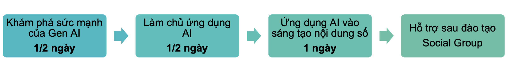
- 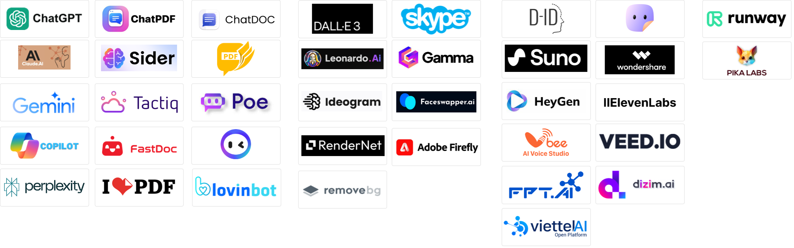
- 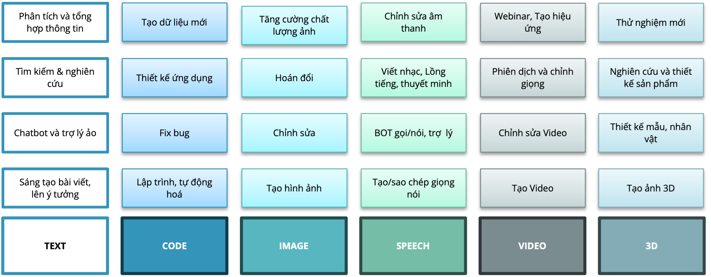
- 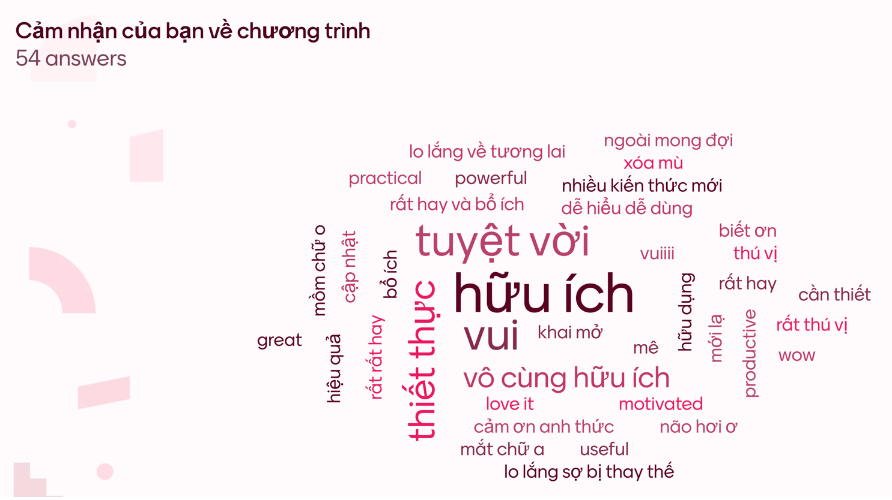
- 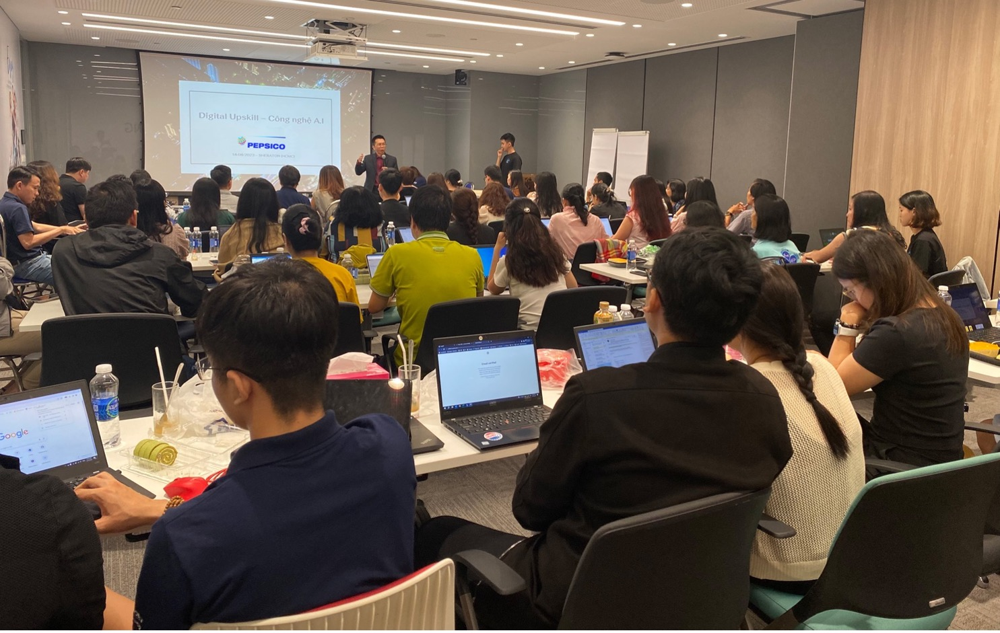
- 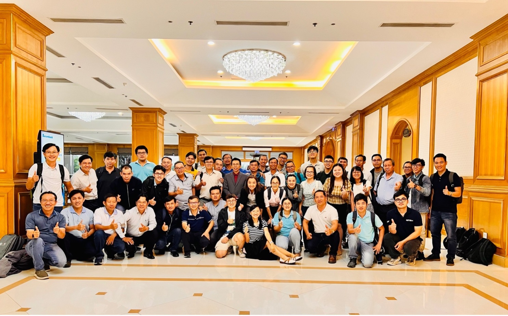
- 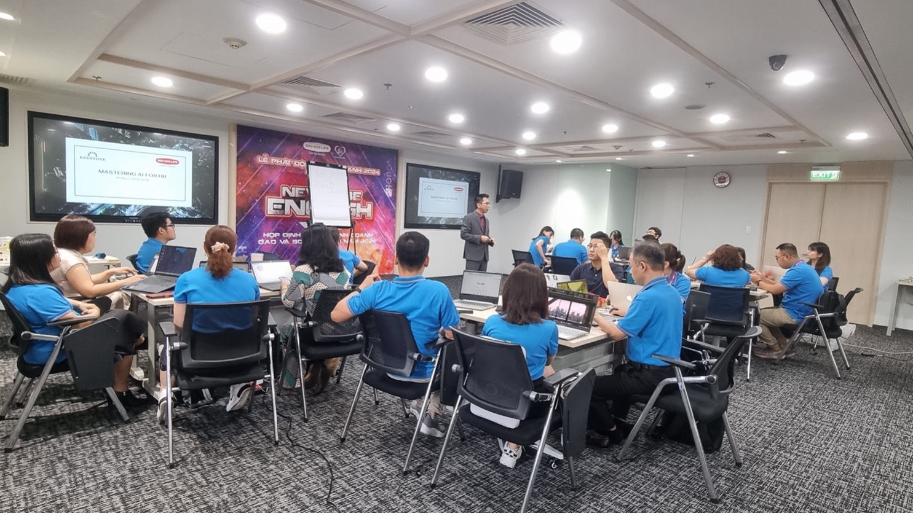
- 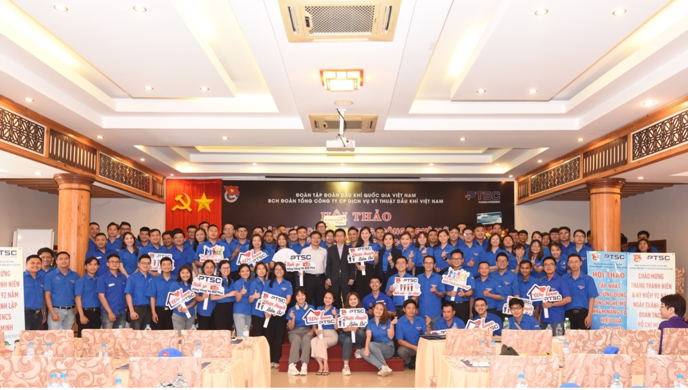
- 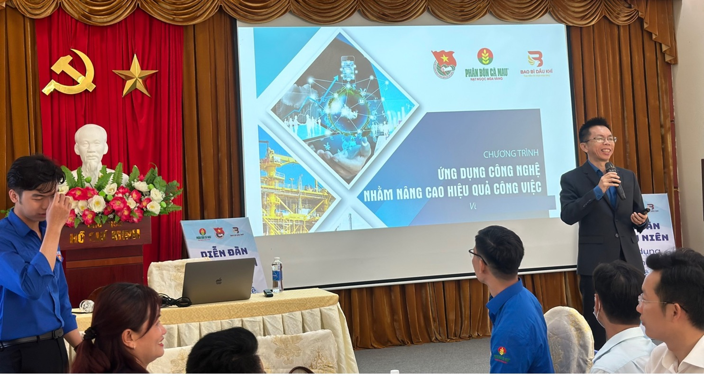
- 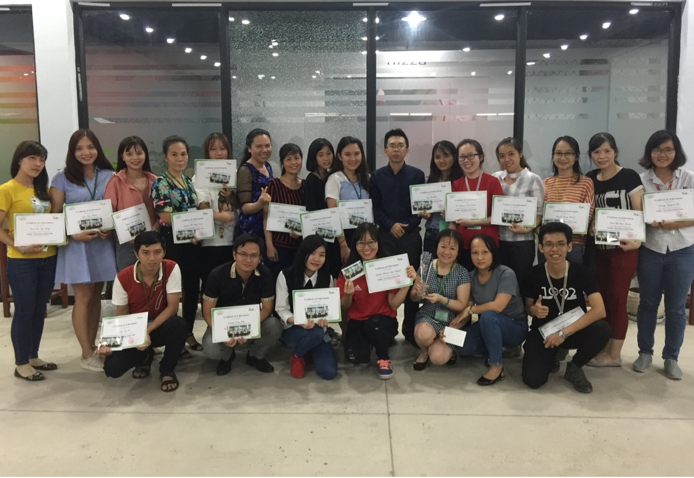
- 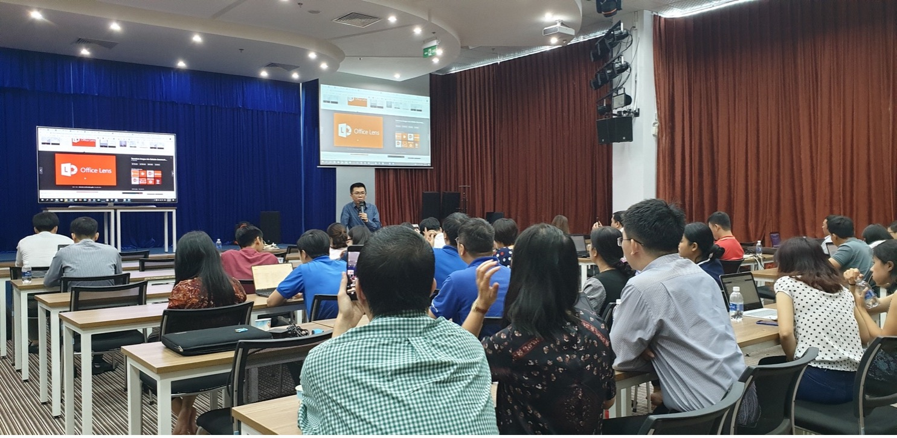
- 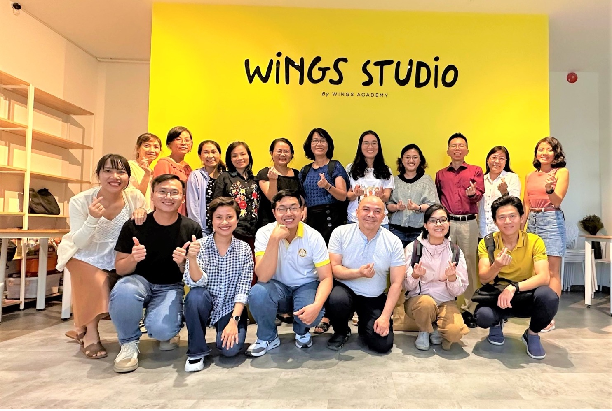
- 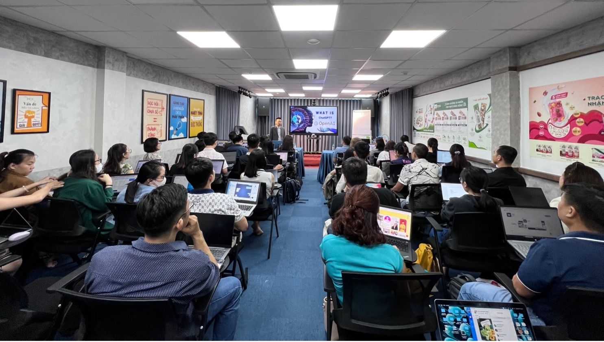
- 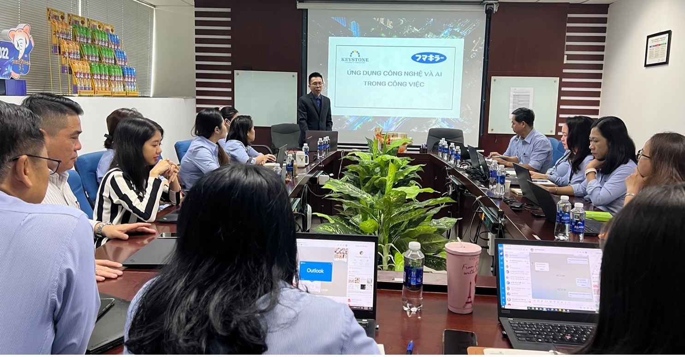
- 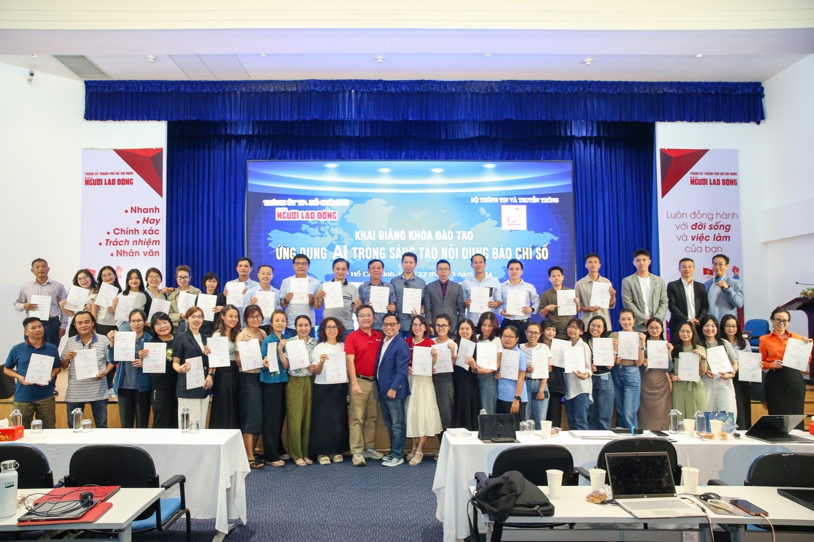
- 
- 
- 

---

## LINK NOI BO TREN TRANG

- [[email protected]](https://keystone.vn)
- [Đăng nhập / Đăng ký](https://keystone.vn/dang-nhap)
- [(no text)](https://keystone.vn/)
- [KEYSTONE!?](https://keystone.vn/keystone)
- [Đào tạo](https://keystone.vn/dao-tao)
- [Huấn luyện](https://keystone.vn/huan-luyen)
- [Teambuilding](https://keystone.vn/teambuilding)
- [Thiết kế doanh nghiệp](https://keystone.vn/thiet-ke-doanh-nghiep)
- [HR Tech](https://keystone.vn/hr-technology-solutions)
- [Ứng Dụng AI](https://keystone.vn/ung-dung-ai)
- [Tools @ Workplace](https://keystone.vn/tools-@-workplace)
- [Train The Trainer](https://keystone.vn/train-the-trainer)
- [Lãnh đạo](https://keystone.vn/lanh-dao)
- [Bán hàng](https://keystone.vn/ban-hang)
- [Quản lý](https://keystone.vn/quan-ly)
- [Tư duy và công cụ](https://keystone.vn/tu-duy-va-cong-cu)
- [Kỹ năng mềm](https://keystone.vn/ky-nang-mem)
- [Giao tiếp](https://keystone.vn/giao-tiep)
- [Events](https://keystone.vn/public-event)
- [Blog](https://keystone.vn/blog)
- [Cộng đồng](https://keystone.vn/cong-dong)
- [Chia sẻ](https://keystone.vn/chia-se)
- [Tuyển Dụng](https://keystone.vn/tuyen-dung)
- [LIÊN HỆ](https://keystone.vn/lien-he)
- [(no text)](https://keystone.vn/Content/hinh/daotaoai/keystone-dao-tao-ai-proposal.pdf)
- [[email protected]](https://keystone.vn/cdn-cgi/l/email-protection)
- [Đào tạo Inhouse "Ứng dụng AI trong doanh nghiệp"](https://keystone.vn/dao-tao-inhouse-ung-dung-ai-trong-doanh-nghiep)
- [Khoá AI - Public - 16/03/2025](https://keystone.vn/khoa-ai-public-16032025)
- [Đào Tạo AI sáng tạo nội dung báo chí số](https://keystone.vn/dao-tao-ai-sang-tao-noi-dung-bao-chi-so)
- [Chính sách và quyền riêng tư](https://keystone.vn/chinh-sach-va-quyen-rieng-tu)
- [Điều khoản sử dụng](https://keystone.vn/dieu-khoan-su-dung)
- [Những câu hỏi thường gặp](https://keystone.vn/nhung-cau-hoi-thuong-gap)
- [Hoàn trả và hủy vé](https://keystone.vn/hoan-tra-va-huy-ve)
- [Phương thức giao hàng](https://keystone.vn/phuong-thuc-giao-hang)
- [Hướng dẫn mua vé](https://keystone.vn/huong-dan-mua-ve)
