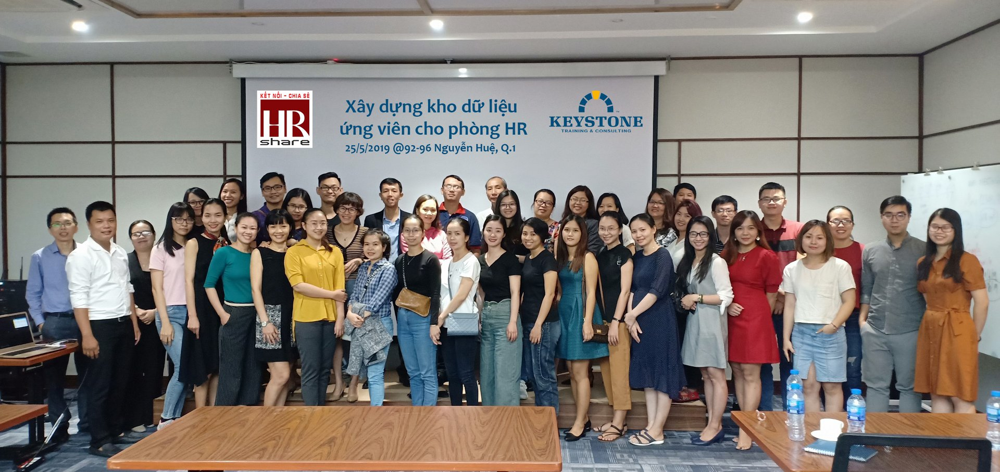

# Bai viet: Xay dung kho du lieu ung vien

- **URL goc:** https://keystone.vn/chia-se-chu-de-xay-dung-kho-du-lieu-ung-vien-cho-phong-hr
- **Slug:** `baiviet-kho-du-lieu-ung-vien-hr`
- **So hinh anh:** 5
- **So link noi bo:** 34

---

## NOI DUNG TEXT

# Chia sẻ chủ đề "Xây dựng kho dữ liệu ứng viên cho phòng HR"

- Mon - Sun: 8.30am to 6.30 pm
- 0903997909
- [email protected]
- Đăng nhập / Đăng ký

- KEYSTONE!?
- DỊCH VỤ Đào tạo Huấn luyện Teambuilding Thiết kế doanh nghiệp HR Tech
- ĐÀO TẠO Ứng Dụng AI Tools @ Workplace Train The Trainer Lãnh đạo Bán hàng Quản lý Tư duy và công cụ Kỹ năng mềm Giao tiếp
- Events
- TIN TỨC Blog Cộng đồng Chia sẻ Tuyển Dụng
- LIÊN HỆ

## Chia sẻ chủ đề "Xây dựng kho dữ liệu ứng viên cho phòng HR"

- Trang chủ
- Keystone

Mỗi thứ 7 hàng tuần, chúng tôi dành thời gian sinh hoạt và tham gia các hoạt động cộng đồng. Đây là chương trình được Keystone phối hợp với group HR Share nhằm chia sẻ góc nhìn của người làm công nghệ trong việc xây dựng kho database ứng viên cho phòng nhân sự.

Buổi offline thu hút được đông đảo sự quan tâm của Anh Chị Em khối nhân sự các công ty miền nam.

Buổi tiếp theo cũng cùng chủ đề này và hướng đến việc thực hành nhiều hơn vào ngày 08/06/2019

Thông tin sự kiện tại đây

#### Danh mục

#### Bài viết liên quan

KEYSTONE | Developing People.

Giải pháp đào tạo chuyên nghiệp!

CÔNG TY CỔ PHẦN CÔNG NGHỆ VÀ ĐÀO TẠO KEYSTONE

Người đại diện: NGUYỄN VĂN THỨC

- Tòa nhà Barotex, Số 6 Võ Văn Kiệt, Phường Sài Gòn, Thành phố Hồ Chí Minh, Việt Nam

### DỊCH VỤ

- Đào tạo
- Huấn luyện
- Teambuilding
- Thiết kế doanh nghiệp
- HR Tech

### ĐÀO TẠO

- Ứng Dụng AI
- Tools @ Workplace
- Train The Trainer
- Lãnh đạo
- Bán hàng
- Quản lý
- Tư duy và công cụ
- Kỹ năng mềm
- Giao tiếp

### HỖ TRỢ

- Chính sách và quyền riêng tư
- Điều khoản sử dụng
- Những câu hỏi thường gặp
- Hoàn trả và hủy vé
- Phương thức giao hàng
- Hướng dẫn mua vé

### Đăng ký email

---

## HINH ANH TREN TRANG

- 
- 
- 
- 
- 

---

## LINK NOI BO TREN TRANG

- [[email protected]](https://keystone.vn)
- [Đăng nhập / Đăng ký](https://keystone.vn/dang-nhap)
- [(no text)](https://keystone.vn/)
- [KEYSTONE!?](https://keystone.vn/keystone)
- [Đào tạo](https://keystone.vn/dao-tao)
- [Huấn luyện](https://keystone.vn/huan-luyen)
- [Teambuilding](https://keystone.vn/teambuilding)
- [Thiết kế doanh nghiệp](https://keystone.vn/thiet-ke-doanh-nghiep)
- [HR Tech](https://keystone.vn/hr-technology-solutions)
- [Ứng Dụng AI](https://keystone.vn/ung-dung-ai)
- [Tools @ Workplace](https://keystone.vn/tools-@-workplace)
- [Train The Trainer](https://keystone.vn/train-the-trainer)
- [Lãnh đạo](https://keystone.vn/lanh-dao)
- [Bán hàng](https://keystone.vn/ban-hang)
- [Quản lý](https://keystone.vn/quan-ly)
- [Tư duy và công cụ](https://keystone.vn/tu-duy-va-cong-cu)
- [Kỹ năng mềm](https://keystone.vn/ky-nang-mem)
- [Giao tiếp](https://keystone.vn/giao-tiep)
- [Events](https://keystone.vn/public-event)
- [Blog](https://keystone.vn/blog)
- [Cộng đồng](https://keystone.vn/cong-dong)
- [Chia sẻ](https://keystone.vn/chia-se)
- [Tuyển Dụng](https://keystone.vn/tuyen-dung)
- [LIÊN HỆ](https://keystone.vn/lien-he)
- [Keystone](https://keystone.vn/categories-keystone)
- [Tools @ Workplace_ NM Đạm Phú Mỹ và PVFCCO](https://keystone.vn/tools-workplace_-nm-dam-phu-my)
- [Cập nhật TOOLS @ WORKPLACE](https://keystone.vn/cap-nhat-tools-workplace)
- [[email protected]](https://keystone.vn/cdn-cgi/l/email-protection)
- [Chính sách và quyền riêng tư](https://keystone.vn/chinh-sach-va-quyen-rieng-tu)
- [Điều khoản sử dụng](https://keystone.vn/dieu-khoan-su-dung)
- [Những câu hỏi thường gặp](https://keystone.vn/nhung-cau-hoi-thuong-gap)
- [Hoàn trả và hủy vé](https://keystone.vn/hoan-tra-va-huy-ve)
- [Phương thức giao hàng](https://keystone.vn/phuong-thuc-giao-hang)
- [Hướng dẫn mua vé](https://keystone.vn/huong-dan-mua-ve)
