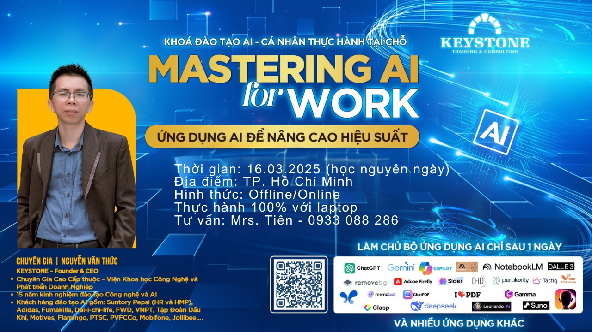
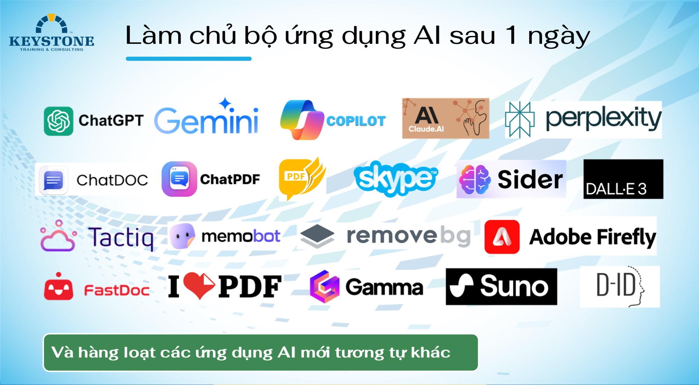
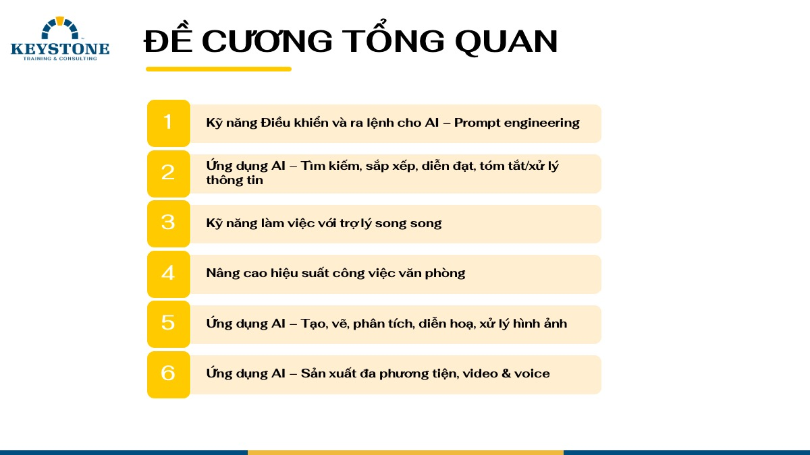

# Bai viet: Khoa AI Public 16/03/2025

- **URL goc:** https://keystone.vn/khoa-ai-public-16032025
- **Slug:** `baiviet-khoa-ai-public-16032025`
- **So hinh anh:** 9
- **So link noi bo:** 37

---

## NOI DUNG TEXT

# Đào tạo ứng dụng AI

> Meta description: Đào tạo ứng dụng AI, Đào tạo AI, đào tạo ứng dụng AI

- Mon - Sun: 8.30am to 6.30 pm
- 0903997909
- [email protected]
- Đăng nhập / Đăng ký

- KEYSTONE!?
- DỊCH VỤ Đào tạo Huấn luyện Teambuilding Thiết kế doanh nghiệp HR Tech
- ĐÀO TẠO Ứng Dụng AI Tools @ Workplace Train The Trainer Lãnh đạo Bán hàng Quản lý Tư duy và công cụ Kỹ năng mềm Giao tiếp
- Events
- TIN TỨC Blog Cộng đồng Chia sẻ Tuyển Dụng
- LIÊN HỆ

## Khoá AI - Public - 16/03/2025

- Trang chủ
- Ứng Dụng AI

KHOÁ ĐÀO TẠO ỨNG DỤNG AI TRONG CÔNG VIỆC - CHUYÊN NGHIỆP Ngày 16/03/2025 - Học nguyên ngày - Thực hành 100% với Laptop + Điện thoại

HÃY NẮM BẮT NGAY CÔNG NGHỆ ĐỂ THĂNG TIẾN VƯỢT TRỘI

XEM NỘI DUNG CHI TIẾT TẠI ĐÂY

https://keystone.vn/Content/hinh/public/KEYSTONE-daotao-ai-public-t3-25.pdf

TƯ VẤN

- NGO THI BICH TIEN
- A ccountant
- 0933 088 286 (Facetime | Zalo | Viber)
- [email protected] | keystone.vn

#### Danh mục

- Tools @ Workplace
- Train The Trainer
- Lãnh đạo
- Bán hàng
- Quản lý
- Tư duy và công cụ
- Kỹ năng mềm
- Giao tiếp

#### Bài viết liên quan

KEYSTONE | Developing People.

Giải pháp đào tạo chuyên nghiệp!

CÔNG TY CỔ PHẦN CÔNG NGHỆ VÀ ĐÀO TẠO KEYSTONE

Người đại diện: NGUYỄN VĂN THỨC

- Tòa nhà Barotex, Số 6 Võ Văn Kiệt, Phường Sài Gòn, Thành phố Hồ Chí Minh, Việt Nam

### DỊCH VỤ

- Đào tạo
- Huấn luyện
- Teambuilding
- Thiết kế doanh nghiệp
- HR Tech

### ĐÀO TẠO

### HỖ TRỢ

- Chính sách và quyền riêng tư
- Điều khoản sử dụng
- Những câu hỏi thường gặp
- Hoàn trả và hủy vé
- Phương thức giao hàng
- Hướng dẫn mua vé

### Đăng ký email

---

## HINH ANH TREN TRANG

- 
- 
- 
- 
- 
- 
- 
- 
- 

---

## LINK NOI BO TREN TRANG

- [[email protected]](https://keystone.vn)
- [Đăng nhập / Đăng ký](https://keystone.vn/dang-nhap)
- [(no text)](https://keystone.vn/)
- [KEYSTONE!?](https://keystone.vn/keystone)
- [Đào tạo](https://keystone.vn/dao-tao)
- [Huấn luyện](https://keystone.vn/huan-luyen)
- [Teambuilding](https://keystone.vn/teambuilding)
- [Thiết kế doanh nghiệp](https://keystone.vn/thiet-ke-doanh-nghiep)
- [HR Tech](https://keystone.vn/hr-technology-solutions)
- [Ứng Dụng AI](https://keystone.vn/ung-dung-ai)
- [Tools @ Workplace](https://keystone.vn/tools-@-workplace)
- [Train The Trainer](https://keystone.vn/train-the-trainer)
- [Lãnh đạo](https://keystone.vn/lanh-dao)
- [Bán hàng](https://keystone.vn/ban-hang)
- [Quản lý](https://keystone.vn/quan-ly)
- [Tư duy và công cụ](https://keystone.vn/tu-duy-va-cong-cu)
- [Kỹ năng mềm](https://keystone.vn/ky-nang-mem)
- [Giao tiếp](https://keystone.vn/giao-tiep)
- [Events](https://keystone.vn/public-event)
- [Blog](https://keystone.vn/blog)
- [Cộng đồng](https://keystone.vn/cong-dong)
- [Chia sẻ](https://keystone.vn/chia-se)
- [Tuyển Dụng](https://keystone.vn/tuyen-dung)
- [LIÊN HỆ](https://keystone.vn/lien-he)
- [(no text)](https://keystone.vn/Content/hinh/public/KEYSTONE-daotao-ai-public-t3-25.pdf)
- [XEM NỘI DUNG CHI TIẾT TẠI ĐÂY](https://keystone.vn/Content/hinh/public/KEYSTONE-daotao-AI-public-t8.pdf)
- [[email protected]](https://keystone.vn/cdn-cgi/l/email-protection#e7868484a78c829e9493888982c99189)
- [Đào tạo Inhouse "Ứng dụng AI trong doanh nghiệp"](https://keystone.vn/dao-tao-inhouse-ung-dung-ai-trong-doanh-nghiep)
- [Đào Tạo AI sáng tạo nội dung báo chí số](https://keystone.vn/dao-tao-ai-sang-tao-noi-dung-bao-chi-so)
- [Mastering AI for Work](https://keystone.vn/dao-tao-ung-dung-ai)
- [[email protected]](https://keystone.vn/cdn-cgi/l/email-protection)
- [Chính sách và quyền riêng tư](https://keystone.vn/chinh-sach-va-quyen-rieng-tu)
- [Điều khoản sử dụng](https://keystone.vn/dieu-khoan-su-dung)
- [Những câu hỏi thường gặp](https://keystone.vn/nhung-cau-hoi-thuong-gap)
- [Hoàn trả và hủy vé](https://keystone.vn/hoan-tra-va-huy-ve)
- [Phương thức giao hàng](https://keystone.vn/phuong-thuc-giao-hang)
- [Hướng dẫn mua vé](https://keystone.vn/huong-dan-mua-ve)
