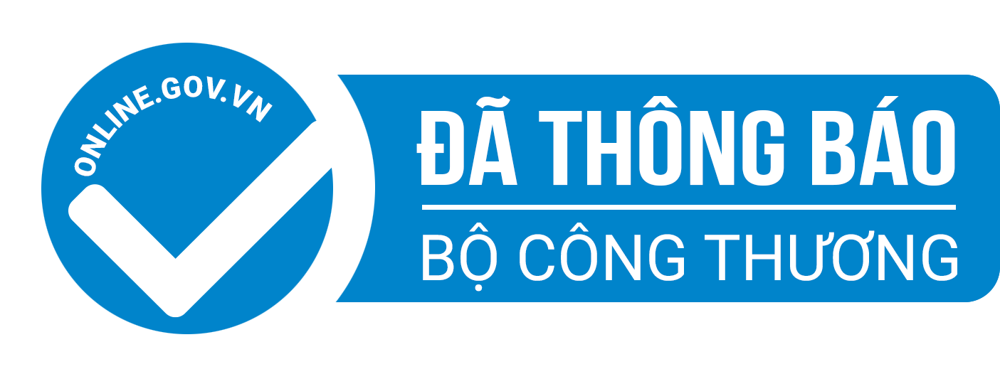

# Bai viet: Group HR Developing People

- **URL goc:** https://keystone.vn/moi-gia-nhap-group-hr-|-developing-people
- **Slug:** `baiviet-moi-gia-nhap-group-hr`
- **So hinh anh:** 6
- **So link noi bo:** 34

---

## NOI DUNG TEXT

# HR | Developing People

- Mon - Sun: 8.30am to 6.30 pm
- 0903997909
- [email protected]
- Đăng nhập / Đăng ký

- KEYSTONE!?
- DỊCH VỤ Đào tạo Huấn luyện Teambuilding Thiết kế doanh nghiệp HR Tech
- ĐÀO TẠO Ứng Dụng AI Tools @ Workplace Train The Trainer Lãnh đạo Bán hàng Quản lý Tư duy và công cụ Kỹ năng mềm Giao tiếp
- Events
- TIN TỨC Blog Cộng đồng Chia sẻ Tuyển Dụng
- LIÊN HỆ

## Mời Gia nhập Group HR | Developing People

- Trang chủ
- HR

HR | Developing People là một cộng đồng hướng đến Chia sẻ kiến thức, kinh nghiệm của các Trainers, HR, L&D… trong việc phát triển nguồn nhân lực.

Phương châm: People of value add value to others

Hoạt động -- Chia sẻ thông tin, tài liệu, các bài viết chuyên môn liên quan đến phát triển con người trong tổ chức nói chung và nghề phát triển con người nói riêng. -- Các tin, bài liên quan ngành Nhân sự, đào tạo, L&D -- Cung cấp công cụ và phương pháp hỗ trợ trong L&D -- Chia sẻ cơ hội hợp tác -- Tổ chức và thông báo offline, event đào tạo, cộng đồng -- Tư vấn, huấn luyện & giải đáp chuyên môn -- Kết nối con người đam mê Developing People

HOẠT ĐỘNG OFFLINE Group tổ chức hoạt động offline nhằm tăng tương tác và chia sẻ từ những chuyên gia giàu kinh nghiệm với những nội dung mà nhiều khi online không truyền tải hết được. -- Tần suất: ~1 offline/tháng -- Tình nguyện viên hỗ trợ --> ib Admin -- Các đội team event, nhà chuyên môn muốn tổ chức hoạt động offline trong group thì cần liên lạc ib BTC/Admin group để phối hợp khâu tổ chức được chu đáo và đúng tinh thần group. -- Group liên tục và rất cần các bạn Volunteers để phục vụ, cho đi nhằm hỗ trợ cồng đồng. Ai có thể hỗ trợ --> ib Admin nhé

NGUYÊN TẮC CHUNG -- Tham gia group là tự nguyện, đồng ý mọi quy định group và chịu trách nhiệm cá nhân 100% cho những phát ngôn của mình -- Group là hoạt động cộng đồng, mọi khoản thu sẽ dùng đầu tư cho hoạt động và sự phát triển của group, các khoản thu chi này sẽ được công bố trong ban tổ chức. -- Thành viên đóng góp và phát triển group bằng cách: Đăng bài viết, like comment, add member mới vào group, truyền thông về group. -- Tuyển dụng các vị trí đúng chuyên môn group như L&D, Trainining, Trainer... -- KHÔNG bàn về chính trị, tôn giáo, xã hội, giới tính, hoặc groups khác -- KHÔNG dùng danh nghĩa của group cho bất kỳ hoạt động nào ngoài group dưới bất kỳ hình thức nào. -- KHÔNG viết hay bình luận tiêu cực, quá khích, châm chọc, chê bai, hơn thua, xúc phạm người khác, hay làm ảnh hưởng xấu đến Group -- BQT Group có toàn quyền quyết định về việc remove các bài viết hoặc account mà BQT thấy chưa phù hợp mà không cần phải giải thích -- Nếu thấy điều gì chưa phù hợp, hãy nói cho chúng tôi biết để sửa đổi và ngược lại

Cảm ơn chúc member mỗi ngày phát triển!

BQT

#### Danh mục

- Training
- Learning & Development

#### Bài viết liên quan

KEYSTONE | Developing People.

Giải pháp đào tạo chuyên nghiệp!

CÔNG TY CỔ PHẦN CÔNG NGHỆ VÀ ĐÀO TẠO KEYSTONE

Người đại diện: NGUYỄN VĂN THỨC

- Tòa nhà Barotex, Số 6 Võ Văn Kiệt, Phường Sài Gòn, Thành phố Hồ Chí Minh, Việt Nam

### DỊCH VỤ

- Đào tạo
- Huấn luyện
- Teambuilding
- Thiết kế doanh nghiệp
- HR Tech

### ĐÀO TẠO

- Ứng Dụng AI
- Tools @ Workplace
- Train The Trainer
- Lãnh đạo
- Bán hàng
- Quản lý
- Tư duy và công cụ
- Kỹ năng mềm
- Giao tiếp

### HỖ TRỢ

- Chính sách và quyền riêng tư
- Điều khoản sử dụng
- Những câu hỏi thường gặp
- Hoàn trả và hủy vé
- Phương thức giao hàng
- Hướng dẫn mua vé

### Đăng ký email

---

## HINH ANH TREN TRANG

- 
- 
- 
- 
- 
- 

---

## LINK NOI BO TREN TRANG

- [[email protected]](https://keystone.vn)
- [Đăng nhập / Đăng ký](https://keystone.vn/dang-nhap)
- [(no text)](https://keystone.vn/)
- [KEYSTONE!?](https://keystone.vn/keystone)
- [Đào tạo](https://keystone.vn/dao-tao)
- [Huấn luyện](https://keystone.vn/huan-luyen)
- [Teambuilding](https://keystone.vn/teambuilding)
- [Thiết kế doanh nghiệp](https://keystone.vn/thiet-ke-doanh-nghiep)
- [HR Tech](https://keystone.vn/hr-technology-solutions)
- [Ứng Dụng AI](https://keystone.vn/ung-dung-ai)
- [Tools @ Workplace](https://keystone.vn/tools-@-workplace)
- [Train The Trainer](https://keystone.vn/train-the-trainer)
- [Lãnh đạo](https://keystone.vn/lanh-dao)
- [Bán hàng](https://keystone.vn/ban-hang)
- [Quản lý](https://keystone.vn/quan-ly)
- [Tư duy và công cụ](https://keystone.vn/tu-duy-va-cong-cu)
- [Kỹ năng mềm](https://keystone.vn/ky-nang-mem)
- [Giao tiếp](https://keystone.vn/giao-tiep)
- [Events](https://keystone.vn/public-event)
- [Blog](https://keystone.vn/blog)
- [Cộng đồng](https://keystone.vn/cong-dong)
- [Chia sẻ](https://keystone.vn/chia-se)
- [Tuyển Dụng](https://keystone.vn/tuyen-dung)
- [LIÊN HỆ](https://keystone.vn/lien-he)
- [HR](https://keystone.vn/hr)
- [Training](https://keystone.vn/training)
- [Learning & Development](https://keystone.vn/learning-development)
- [[email protected]](https://keystone.vn/cdn-cgi/l/email-protection)
- [Chính sách và quyền riêng tư](https://keystone.vn/chinh-sach-va-quyen-rieng-tu)
- [Điều khoản sử dụng](https://keystone.vn/dieu-khoan-su-dung)
- [Những câu hỏi thường gặp](https://keystone.vn/nhung-cau-hoi-thuong-gap)
- [Hoàn trả và hủy vé](https://keystone.vn/hoan-tra-va-huy-ve)
- [Phương thức giao hàng](https://keystone.vn/phuong-thuc-giao-hang)
- [Hướng dẫn mua vé](https://keystone.vn/huong-dan-mua-ve)
