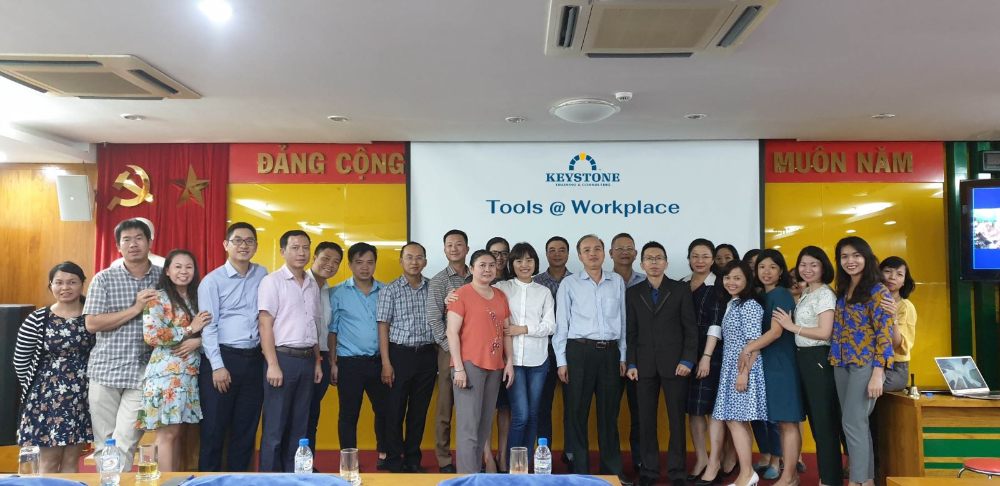
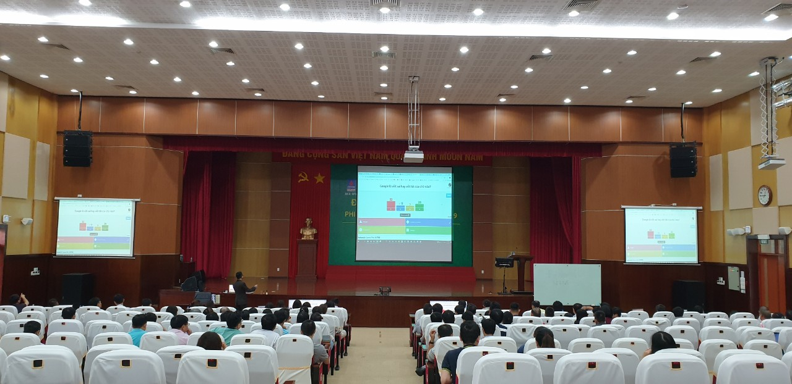
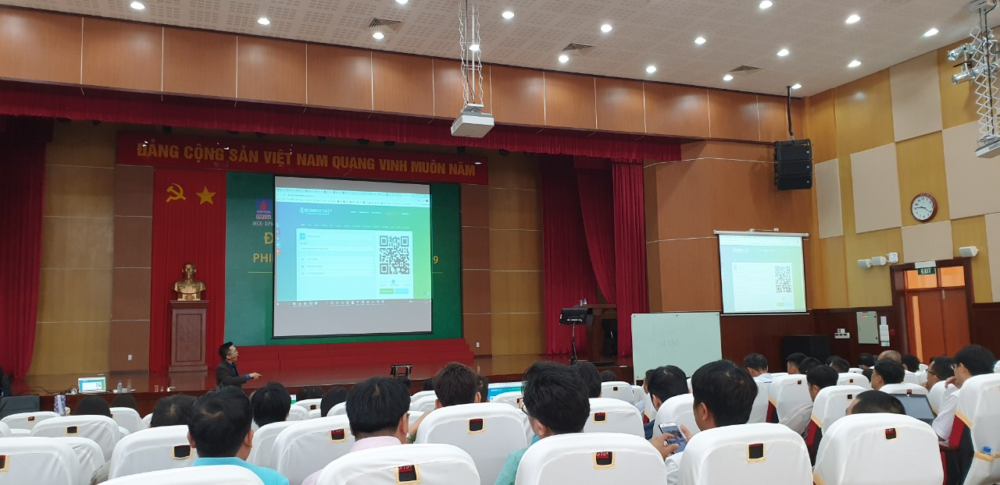

# Bai viet: Tools Workplace NM Dam Phu My

- **URL goc:** https://keystone.vn/tools-workplace_-nm-dam-phu-my
- **Slug:** `baiviet-tools-workplace-pmu`
- **So hinh anh:** 8
- **So link noi bo:** 34

---

## NOI DUNG TEXT

# Inhouse Training Nhà máy Đạm Phú Mỹ

> Meta description: Đây là chương trình đào tạo về kỹ năng công nghệ và ứng dụng trong công việc nhằm nâng cao hiệu suất

- Mon - Sun: 8.30am to 6.30 pm
- 0903997909
- [email protected]
- Đăng nhập / Đăng ký

- KEYSTONE!?
- DỊCH VỤ Đào tạo Huấn luyện Teambuilding Thiết kế doanh nghiệp HR Tech
- ĐÀO TẠO Ứng Dụng AI Tools @ Workplace Train The Trainer Lãnh đạo Bán hàng Quản lý Tư duy và công cụ Kỹ năng mềm Giao tiếp
- Events
- TIN TỨC Blog Cộng đồng Chia sẻ Tuyển Dụng
- LIÊN HỆ

## Tools @ Workplace_ NM Đạm Phú Mỹ và PVFCCO

- Trang chủ
- Keystone

Không chỉ khối nhà máy Đạm Phú Mỹ, mà khối văn phòng PVFCCO cũng quan tâm việc nâng cao hiệu suất công việc của mình qua việc ứng dụng công nghệ.

Buổi đào tạo được ban lãnh đạo nhà máy đánh giá rất cao. Hai sếp lớn của nhà máy đã dự đủ cho đến tận phút cuối giờ! Đây là một sự thành công lớn cho Keystone khi truyền tải được một chương trình đầy sinh động, hấp dẫn và giá trị cho Anh Em nhà máy.

Chương trình đã giúp mỗi người hiểu thêm và biết cách vận dụng những công cụ rất cơ bản trong hệ sinh thái của Google, Microsoft,... để ứng dụng không chỉ trong công việc và trong cả đời sống.

Mã QR đối với mọi người giờ đây không còn xa lạ nữa, cách thu thập thông tin không còn vất vả nữa, cách làm báo cáo trong vòng 1 nốt nhạc giờ đây không còn tốn thời gian nữa, cách trình bày cho bài thuyết trình sinh động bắt mắt giờ đây trở nên dễ dàng hơn... và hàng chục lợi ích to lớn như vậy được Keystone chuyển giao trọn vẹn.

Chúc Nhà Máy Đạm Phú Mý, PVFCCO luôn thành công, phát triển, tiên phong cải tiến để đột phá & đạt những mục tiêu lớn!

Trân trọng,

#### Danh mục

#### Bài viết liên quan

KEYSTONE | Developing People.

Giải pháp đào tạo chuyên nghiệp!

CÔNG TY CỔ PHẦN CÔNG NGHỆ VÀ ĐÀO TẠO KEYSTONE

Người đại diện: NGUYỄN VĂN THỨC

- Tòa nhà Barotex, Số 6 Võ Văn Kiệt, Phường Sài Gòn, Thành phố Hồ Chí Minh, Việt Nam

### DỊCH VỤ

- Đào tạo
- Huấn luyện
- Teambuilding
- Thiết kế doanh nghiệp
- HR Tech

### ĐÀO TẠO

- Ứng Dụng AI
- Tools @ Workplace
- Train The Trainer
- Lãnh đạo
- Bán hàng
- Quản lý
- Tư duy và công cụ
- Kỹ năng mềm
- Giao tiếp

### HỖ TRỢ

- Chính sách và quyền riêng tư
- Điều khoản sử dụng
- Những câu hỏi thường gặp
- Hoàn trả và hủy vé
- Phương thức giao hàng
- Hướng dẫn mua vé

### Đăng ký email

---

## HINH ANH TREN TRANG

- 
- 
- 
- 
- 
- 
- 
- 

---

## LINK NOI BO TREN TRANG

- [[email protected]](https://keystone.vn)
- [Đăng nhập / Đăng ký](https://keystone.vn/dang-nhap)
- [(no text)](https://keystone.vn/)
- [KEYSTONE!?](https://keystone.vn/keystone)
- [Đào tạo](https://keystone.vn/dao-tao)
- [Huấn luyện](https://keystone.vn/huan-luyen)
- [Teambuilding](https://keystone.vn/teambuilding)
- [Thiết kế doanh nghiệp](https://keystone.vn/thiet-ke-doanh-nghiep)
- [HR Tech](https://keystone.vn/hr-technology-solutions)
- [Ứng Dụng AI](https://keystone.vn/ung-dung-ai)
- [Tools @ Workplace](https://keystone.vn/tools-@-workplace)
- [Train The Trainer](https://keystone.vn/train-the-trainer)
- [Lãnh đạo](https://keystone.vn/lanh-dao)
- [Bán hàng](https://keystone.vn/ban-hang)
- [Quản lý](https://keystone.vn/quan-ly)
- [Tư duy và công cụ](https://keystone.vn/tu-duy-va-cong-cu)
- [Kỹ năng mềm](https://keystone.vn/ky-nang-mem)
- [Giao tiếp](https://keystone.vn/giao-tiep)
- [Events](https://keystone.vn/public-event)
- [Blog](https://keystone.vn/blog)
- [Cộng đồng](https://keystone.vn/cong-dong)
- [Chia sẻ](https://keystone.vn/chia-se)
- [Tuyển Dụng](https://keystone.vn/tuyen-dung)
- [LIÊN HỆ](https://keystone.vn/lien-he)
- [Keystone](https://keystone.vn/categories-keystone)
- [Cập nhật TOOLS @ WORKPLACE](https://keystone.vn/cap-nhat-tools-workplace)
- [Chia sẻ chủ đề "Xây dựng kho dữ liệu ứng viên cho phòng HR"](https://keystone.vn/chia-se-chu-de-xay-dung-kho-du-lieu-ung-vien-cho-phong-hr)
- [[email protected]](https://keystone.vn/cdn-cgi/l/email-protection)
- [Chính sách và quyền riêng tư](https://keystone.vn/chinh-sach-va-quyen-rieng-tu)
- [Điều khoản sử dụng](https://keystone.vn/dieu-khoan-su-dung)
- [Những câu hỏi thường gặp](https://keystone.vn/nhung-cau-hoi-thuong-gap)
- [Hoàn trả và hủy vé](https://keystone.vn/hoan-tra-va-huy-ve)
- [Phương thức giao hàng](https://keystone.vn/phuong-thuc-giao-hang)
- [Hướng dẫn mua vé](https://keystone.vn/huong-dan-mua-ve)
