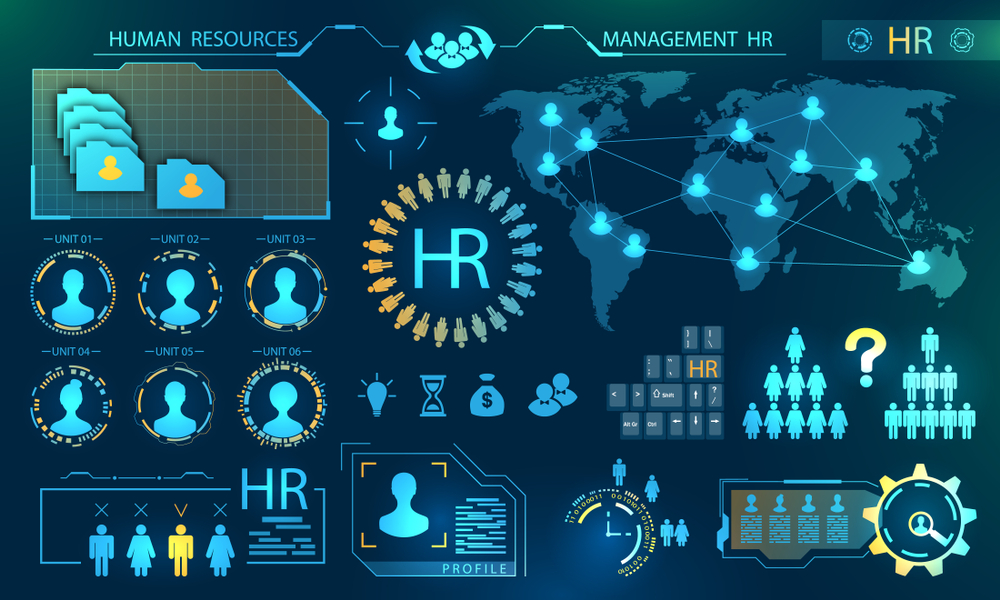

# HR Technology Solutions

- **URL goc:** https://keystone.vn/hr-technology-solutions
- **Slug:** `hr-technology-solutions`
- **So hinh anh:** 4
- **So link noi bo:** 31

---

## NOI DUNG TEXT

# HR Tech

- Mon - Sun: 8.30am to 6.30 pm
- 0903997909
- [email protected]
- Đăng nhập / Đăng ký

- KEYSTONE!?
- DỊCH VỤ Đào tạo Huấn luyện Teambuilding Thiết kế doanh nghiệp HR Tech
- ĐÀO TẠO Ứng Dụng AI Tools @ Workplace Train The Trainer Lãnh đạo Bán hàng Quản lý Tư duy và công cụ Kỹ năng mềm Giao tiếp
- Events
- TIN TỨC Blog Cộng đồng Chia sẻ Tuyển Dụng
- LIÊN HỆ

## HR Tech

- Trang chủ
- Dịch vụ

### From DATA TO INFORMATION & DECISION

Keystone có đội ngũ, chuyên gia nghiên cứu và triển khai tư vấn ứng dụng công nghệ cho bộ phận HR và L&D trong các công ty tập đoàn trong và ngoài nước.

Các chủ đề và ứng dụng có thể kể đến như sau:

- HRCRM | Xây dựng kho dữ liệu ứng viên
- HCMI | Hệ thống Phân tích số liệu nhân sự
- HRS | Phần mềm Quản trị nhân sự toàn diện
- LMS | Hệ thống quản lý đào tạo, học tập & phát triển
- EVENT MANAGEMENT | Hệ thống QL sự kiện bằng vé QR Code
- HR PAGES | Hệ thống trang tuyển dụng
- HS | Hệ thống tuyển dụng
- HRG | Hệ thống tích điểm, đổi quà tặng quà sinh nhật cho nhân viên

Không chỉ vậy, chúng tôi còn có một hệ thống các Partners để cung cấp toàn bộ và đầy đủ hạ tầng từ công nghệ (technology) cho đến nội dung (content) hay vận hành nó (organize) cho bộ phận HR, L&D hay toàn bộ tổ chức

Hãy liên hệ để gặp gỡ chuyên gia của chúng tôi cho các dự án công nghệ tại Bộ phận HR của công ty/Tổ chức bạn đang công tác!

- Đào tạo
- Huấn luyện
- Teambuilding
- Thiết kế doanh nghiệp

#### Liên hệ với chúng tôi

KEYSTONE | Developing People.

Giải pháp đào tạo chuyên nghiệp!

CÔNG TY CỔ PHẦN CÔNG NGHỆ VÀ ĐÀO TẠO KEYSTONE

Người đại diện: NGUYỄN VĂN THỨC

- Tòa nhà Barotex, Số 6 Võ Văn Kiệt, Phường Sài Gòn, Thành phố Hồ Chí Minh, Việt Nam

### DỊCH VỤ

### ĐÀO TẠO

- Ứng Dụng AI
- Tools @ Workplace
- Train The Trainer
- Lãnh đạo
- Bán hàng
- Quản lý
- Tư duy và công cụ
- Kỹ năng mềm
- Giao tiếp

### HỖ TRỢ

- Chính sách và quyền riêng tư
- Điều khoản sử dụng
- Những câu hỏi thường gặp
- Hoàn trả và hủy vé
- Phương thức giao hàng
- Hướng dẫn mua vé

### Đăng ký email

---

## HINH ANH TREN TRANG

- 
- 
- 
- 

---

## LINK NOI BO TREN TRANG

- [[email protected]](https://keystone.vn)
- [Đăng nhập / Đăng ký](https://keystone.vn/dang-nhap)
- [(no text)](https://keystone.vn/)
- [KEYSTONE!?](https://keystone.vn/keystone)
- [Đào tạo](https://keystone.vn/dao-tao)
- [Huấn luyện](https://keystone.vn/huan-luyen)
- [Teambuilding](https://keystone.vn/teambuilding)
- [Thiết kế doanh nghiệp](https://keystone.vn/thiet-ke-doanh-nghiep)
- [HR Tech](https://keystone.vn/hr-technology-solutions)
- [Ứng Dụng AI](https://keystone.vn/ung-dung-ai)
- [Tools @ Workplace](https://keystone.vn/tools-@-workplace)
- [Train The Trainer](https://keystone.vn/train-the-trainer)
- [Lãnh đạo](https://keystone.vn/lanh-dao)
- [Bán hàng](https://keystone.vn/ban-hang)
- [Quản lý](https://keystone.vn/quan-ly)
- [Tư duy và công cụ](https://keystone.vn/tu-duy-va-cong-cu)
- [Kỹ năng mềm](https://keystone.vn/ky-nang-mem)
- [Giao tiếp](https://keystone.vn/giao-tiep)
- [Events](https://keystone.vn/public-event)
- [Blog](https://keystone.vn/blog)
- [Cộng đồng](https://keystone.vn/cong-dong)
- [Chia sẻ](https://keystone.vn/chia-se)
- [Tuyển Dụng](https://keystone.vn/tuyen-dung)
- [LIÊN HỆ](https://keystone.vn/lien-he)
- [[email protected]](https://keystone.vn/cdn-cgi/l/email-protection)
- [Chính sách và quyền riêng tư](https://keystone.vn/chinh-sach-va-quyen-rieng-tu)
- [Điều khoản sử dụng](https://keystone.vn/dieu-khoan-su-dung)
- [Những câu hỏi thường gặp](https://keystone.vn/nhung-cau-hoi-thuong-gap)
- [Hoàn trả và hủy vé](https://keystone.vn/hoan-tra-va-huy-ve)
- [Phương thức giao hàng](https://keystone.vn/phuong-thuc-giao-hang)
- [Hướng dẫn mua vé](https://keystone.vn/huong-dan-mua-ve)
